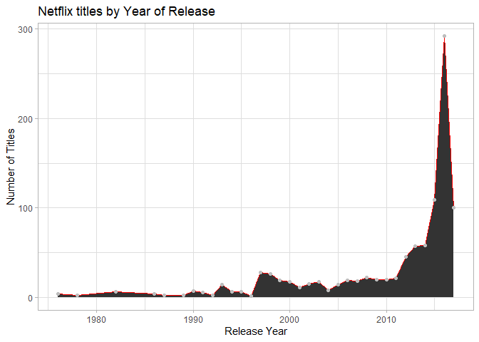
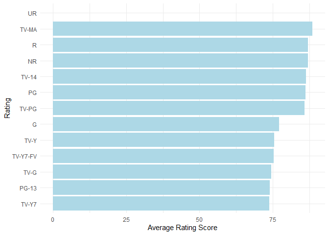
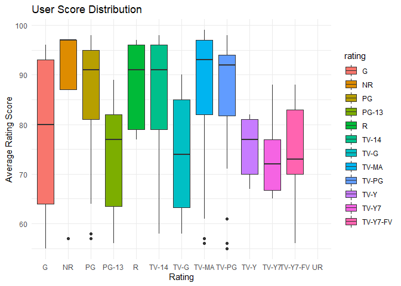

**Some recommendations to explore:**

***
-	Perhaps add an executive summary to a README.md (Markdown) file. You can also include 1-2 plots saved from the ones you created with ggplot2 here. **Will add comments to the final README and saved the plots as png files.**
-	You can work with the R-chunks of code to customize them in such a way that you have control of how the output is displayed (for example, message = FALSE will not print the “Parsed with column specification:” message when the .csv is read **Removed uneccessary message from some of the R-chunks**
-	I noticed you saved a copy to a local folder in your computer (using write.csv() ). When using projects (.Rproj), you can improve reproducibility by having everything “local” – that’s the reason for the data/ folder. This way anyone (include a future you) can re-run the analysis without having to modify that path to your C:/Users/… folder **I now understand the concept of keeping the data and the report "together" for reproducibility**
-	I noticed the last chart did not use the same “theme” than the previous two. Consider choosing one for consistency **I corrected this**

***


```r
library(tidyverse)
```

```
## -- Attaching packages ----------------------------------------------------------------------------------------- tidyverse 1.3.0 --
```

```
## v ggplot2 3.3.2     v purrr   0.3.4
## v tibble  3.0.3     v dplyr   1.0.2
## v tidyr   1.1.2     v stringr 1.4.0
## v readr   1.3.1     v forcats 0.5.0
```

```
## -- Conflicts -------------------------------------------------------------------------------------------- tidyverse_conflicts() --
## x dplyr::filter() masks stats::filter()
## x dplyr::lag()    masks stats::lag()
```

`


```r
netflix_shows <- read_csv("https://raw.githubusercontent.com/reisanar/datasets/master/netflixShows.csv")
```

```
## Parsed with column specification:
## cols(
##   title = col_character(),
##   rating = col_character(),
##   ratingLevel = col_character(),
##   ratingDescription = col_double(),
##   `release year` = col_double(),
##   `user rating score` = col_double(),
##   `user rating size` = col_double()
## )
```

```r
head(netflix_shows)
```

<div data-pagedtable="false">
  <script data-pagedtable-source type="application/json">
{"columns":[{"label":["title"],"name":[1],"type":["chr"],"align":["left"]},{"label":["rating"],"name":[2],"type":["chr"],"align":["left"]},{"label":["ratingLevel"],"name":[3],"type":["chr"],"align":["left"]},{"label":["ratingDescription"],"name":[4],"type":["dbl"],"align":["right"]},{"label":["release year"],"name":[5],"type":["dbl"],"align":["right"]},{"label":["user rating score"],"name":[6],"type":["dbl"],"align":["right"]},{"label":["user rating size"],"name":[7],"type":["dbl"],"align":["right"]}],"data":[{"1":"White Chicks","2":"PG-13","3":"crude and sexual humor, language and some drug content","4":"80","5":"2004","6":"82","7":"80"},{"1":"Lucky Number Slevin","2":"R","3":"strong violence, sexual content and adult language","4":"100","5":"2006","6":"NA","7":"82"},{"1":"Grey's Anatomy","2":"TV-14","3":"Parents strongly cautioned. May be unsuitable for children ages 14 and under.","4":"90","5":"2016","6":"98","7":"80"},{"1":"Prison Break","2":"TV-14","3":"Parents strongly cautioned. May be unsuitable for children ages 14 and under.","4":"90","5":"2008","6":"98","7":"80"},{"1":"How I Met Your Mother","2":"TV-PG","3":"Parental guidance suggested. May not be suitable for all children.","4":"70","5":"2014","6":"94","7":"80"},{"1":"Supernatural","2":"TV-14","3":"Parents strongly cautioned. May be unsuitable for children ages 14 and under.","4":"90","5":"2016","6":"95","7":"80"}],"options":{"columns":{"min":{},"max":[10]},"rows":{"min":[10],"max":[10]},"pages":{}}}
  </script>
</div>

## Understanding shows rated TV-MA and the ratings in 2016


```r
netflix_shows %>% 
   filter(`release year` == "2016") %>% 
  select(title, rating, `user rating score`) %>% 
   filter(rating == "TV-MA") %>% 
  arrange(desc(`user rating score`))
```

<div data-pagedtable="false">
  <script data-pagedtable-source type="application/json">
{"columns":[{"label":["title"],"name":[1],"type":["chr"],"align":["left"]},{"label":["rating"],"name":[2],"type":["chr"],"align":["left"]},{"label":["user rating score"],"name":[3],"type":["dbl"],"align":["right"]}],"data":[{"1":"Orange Is the New Black","2":"TV-MA","3":"98"},{"1":"Orange Is the New Black","2":"TV-MA","3":"98"},{"1":"Orange Is the New Black","2":"TV-MA","3":"98"},{"1":"Orange Is the New Black","2":"TV-MA","3":"98"},{"1":"Shameless (U.S.)","2":"TV-MA","3":"97"},{"1":"Shameless (U.S.)","2":"TV-MA","3":"97"},{"1":"Shameless (U.S.)","2":"TV-MA","3":"97"},{"1":"Shameless (U.S.)","2":"TV-MA","3":"97"},{"1":"Shameless (U.S.)","2":"TV-MA","3":"97"},{"1":"Shameless (U.S.)","2":"TV-MA","3":"97"},{"1":"Marvel's Luke Cage","2":"TV-MA","3":"95"},{"1":"Better Call Saul","2":"TV-MA","3":"95"},{"1":"Better Call Saul","2":"TV-MA","3":"95"},{"1":"Narcos","2":"TV-MA","3":"94"},{"1":"Narcos","2":"TV-MA","3":"94"},{"1":"It's Always Sunny in Philadelphia","2":"TV-MA","3":"91"},{"1":"House of Cards","2":"TV-MA","3":"91"},{"1":"House of Cards","2":"TV-MA","3":"91"},{"1":"House of Cards","2":"TV-MA","3":"91"},{"1":"American Horror Story","2":"TV-MA","3":"90"},{"1":"The Magicians","2":"TV-MA","3":"89"},{"1":"Travelers","2":"TV-MA","3":"86"},{"1":"The Do-Over","2":"TV-MA","3":"84"},{"1":"The Crown","2":"TV-MA","3":"84"},{"1":"Black Mirror","2":"TV-MA","3":"80"},{"1":"Black Mirror","2":"TV-MA","3":"80"},{"1":"Black Mirror","2":"TV-MA","3":"80"},{"1":"American Crime Story: The People v. O.J. Simpson","2":"TV-MA","3":"79"},{"1":"Only for One Night","2":"TV-MA","3":"78"},{"1":"Only for One Night","2":"TV-MA","3":"78"},{"1":"The Fall","2":"TV-MA","3":"61"},{"1":"The Fall","2":"TV-MA","3":"61"},{"1":"Hap and Leonard","2":"TV-MA","3":"57"},{"1":"The Doctor Blake Mysteries","2":"TV-MA","3":"57"},{"1":"The Doctor Blake Mysteries","2":"TV-MA","3":"57"},{"1":"Bitten","2":"TV-MA","3":"56"},{"1":"3%","2":"TV-MA","3":"NA"},{"1":"Salvador Martinha - Tip of the Tongue","2":"TV-MA","3":"NA"},{"1":"O Amor no Div<ed><U+00A3>","2":"TV-MA","3":"NA"},{"1":"Pandora","2":"TV-MA","3":"NA"},{"1":"The OA","2":"TV-MA","3":"NA"},{"1":"Lovesick","2":"TV-MA","3":"NA"},{"1":"Flaked","2":"TV-MA","3":"NA"},{"1":"Easy","2":"TV-MA","3":"NA"},{"1":"BoJack Horseman","2":"TV-MA","3":"NA"},{"1":"Lovesick","2":"TV-MA","3":"NA"},{"1":"Easy","2":"TV-MA","3":"NA"},{"1":"A Weekend with the Family","2":"TV-MA","3":"NA"},{"1":"Crazyhead","2":"TV-MA","3":"NA"},{"1":"Hurricane Bianca","2":"TV-MA","3":"NA"},{"1":"Lazy Eye","2":"TV-MA","3":"NA"},{"1":"Boy Bye","2":"TV-MA","3":"NA"},{"1":"Better Off Single","2":"TV-MA","3":"NA"},{"1":"Bloodline","2":"TV-MA","3":"NA"},{"1":"100 Metros","2":"TV-MA","3":"NA"},{"1":"Ripper Street","2":"TV-MA","3":"NA"},{"1":"Bordertown","2":"TV-MA","3":"NA"}],"options":{"columns":{"min":{},"max":[10]},"rows":{"min":[10],"max":[10]},"pages":{}}}
  </script>
</div>


## Using functions from `dplyr` package to summarize the data 

Displaying the average score per release year, sorting by the avg rating score. Appears that 2017 release year has the average highest rating score.


```r
netflix_years <- netflix_shows %>% 
  select(`release year`, `user rating score`) %>%
  group_by(`release year`) %>%
  summarize(avg_rating_score = mean(`user rating score`, na.rm = TRUE)) %>% 
  arrange(desc(avg_rating_score))
```

```
## `summarise()` ungrouping output (override with `.groups` argument)
```

```r
head(netflix_years)
```

<div data-pagedtable="false">
  <script data-pagedtable-source type="application/json">
{"columns":[{"label":["release year"],"name":[1],"type":["dbl"],"align":["right"]},{"label":["avg_rating_score"],"name":[2],"type":["dbl"],"align":["right"]}],"data":[{"1":"2017","2":"90.42623"},{"1":"2002","2":"89.37500"},{"1":"2011","2":"89.33333"},{"1":"2005","2":"89.30000"},{"1":"2000","2":"88.91667"},{"1":"2008","2":"87.18750"}],"options":{"columns":{"min":{},"max":[10]},"rows":{"min":[10],"max":[10]},"pages":{}}}
  </script>
</div>
Testing to see why some years show as NaN, simply no user rating score in the data.


```r
netflix_shows_76 <- netflix_shows %>% 
  filter(`release year` ==  "1991")
netflix_shows_76
```

<div data-pagedtable="false">
  <script data-pagedtable-source type="application/json">
{"columns":[{"label":["title"],"name":[1],"type":["chr"],"align":["left"]},{"label":["rating"],"name":[2],"type":["chr"],"align":["left"]},{"label":["ratingLevel"],"name":[3],"type":["chr"],"align":["left"]},{"label":["ratingDescription"],"name":[4],"type":["dbl"],"align":["right"]},{"label":["release year"],"name":[5],"type":["dbl"],"align":["right"]},{"label":["user rating score"],"name":[6],"type":["dbl"],"align":["right"]},{"label":["user rating size"],"name":[7],"type":["dbl"],"align":["right"]}],"data":[{"1":"An American Tail: Fievel Goes West","2":"G","3":"General Audiences. Suitable for all ages.","4":"35","5":"1991","6":"NA","7":"82"},{"1":"An American Tail: Fievel Goes West","2":"G","3":"General Audiences. Suitable for all ages.","4":"35","5":"1991","6":"NA","7":"82"},{"1":"An American Tail: Fievel Goes West","2":"G","3":"General Audiences. Suitable for all ages.","4":"35","5":"1991","6":"NA","7":"82"},{"1":"An American Tail: Fievel Goes West","2":"G","3":"General Audiences. Suitable for all ages.","4":"35","5":"1991","6":"NA","7":"82"},{"1":"An American Tail: Fievel Goes West","2":"G","3":"General Audiences. Suitable for all ages.","4":"35","5":"1991","6":"NA","7":"82"}],"options":{"columns":{"min":{},"max":[10]},"rows":{"min":[10],"max":[10]},"pages":{}}}
  </script>
</div>

Wanting to get a better idea of the distribution of number of movies by release year, 2016 has a lot more than other years. This is most likely due to Netflix original content being pushed.


```r
netflix_shows_count <- netflix_shows %>% 
  group_by(`release year`) %>% 
  filter(`release year` >= 1975) %>% 
 count() %>% 
  arrange(desc(`release year`))
netflix_shows_count
```

<div data-pagedtable="false">
  <script data-pagedtable-source type="application/json">
{"columns":[{"label":["release year"],"name":[1],"type":["dbl"],"align":["right"]},{"label":["n"],"name":[2],"type":["int"],"align":["right"]}],"data":[{"1":"2017","2":"100"},{"1":"2016","2":"292"},{"1":"2015","2":"109"},{"1":"2014","2":"58"},{"1":"2013","2":"57"},{"1":"2012","2":"45"},{"1":"2011","2":"21"},{"1":"2010","2":"20"},{"1":"2009","2":"20"},{"1":"2008","2":"22"},{"1":"2007","2":"18"},{"1":"2006","2":"19"},{"1":"2005","2":"14"},{"1":"2004","2":"8"},{"1":"2003","2":"17"},{"1":"2002","2":"15"},{"1":"2001","2":"11"},{"1":"2000","2":"17"},{"1":"1999","2":"19"},{"1":"1998","2":"26"},{"1":"1997","2":"28"},{"1":"1996","2":"1"},{"1":"1995","2":"6"},{"1":"1994","2":"6"},{"1":"1993","2":"14"},{"1":"1992","2":"2"},{"1":"1991","2":"5"},{"1":"1990","2":"7"},{"1":"1989","2":"2"},{"1":"1987","2":"2"},{"1":"1986","2":"4"},{"1":"1982","2":"6"},{"1":"1978","2":"2"},{"1":"1976","2":"4"}],"options":{"columns":{"min":{},"max":[10]},"rows":{"min":[10],"max":[10]},"pages":{}}}
  </script>
</div>


## First Plot: Exploring number of titles by release year


```r
# This plot helps to paint the picture of 2016 release year having a lot more titles compared to other years. Definitely a case of Netflix pushing original content throughout the year. By excluding the few titles with release years prior to 1975, we are able to see the volume of titles by release year more clearly.

number_of_titles_by_year <-
  ggplot(data=netflix_shows_count, aes(`release year`, y=n)) +
  geom_area(color = "red") +
  geom_point(color = "grey") +
  labs(y = "Number of Titles", x = "Release Year",
       title = "Netflix titles by Year of Release") +
  theme_light()

number_of_titles_by_year
```

<!-- -->


Displaying the average score per rating type, sorting by the avg rating score. Very interesting to see the rating types such as TV-MA and R get a higher average score. Most likely due to adults giving the rating?


```r
netflix_years_rating <- netflix_shows %>% 
  select(`rating`, `user rating score`) %>%
  group_by(`rating`) %>%
  summarize(avg_rating_score = mean(`user rating score`, na.rm = TRUE)) %>% 
  arrange(desc(avg_rating_score))
```

```
## `summarise()` ungrouping output (override with `.groups` argument)
```

```r
head(netflix_years_rating,30)
```

<div data-pagedtable="false">
  <script data-pagedtable-source type="application/json">
{"columns":[{"label":["rating"],"name":[1],"type":["chr"],"align":["left"]},{"label":["avg_rating_score"],"name":[2],"type":["dbl"],"align":["right"]}],"data":[{"1":"TV-MA","2":"88.52083"},{"1":"R","2":"87.11111"},{"1":"NR","2":"87.00000"},{"1":"TV-14","2":"86.42553"},{"1":"PG","2":"86.20168"},{"1":"TV-PG","2":"85.85714"},{"1":"G","2":"77.24561"},{"1":"TV-Y","2":"75.60000"},{"1":"TV-Y7-FV","2":"75.31250"},{"1":"TV-G","2":"74.50000"},{"1":"PG-13","2":"74.00000"},{"1":"TV-Y7","2":"73.92857"},{"1":"UR","2":"NaN"}],"options":{"columns":{"min":{},"max":[10]},"rows":{"min":[10],"max":[10]},"pages":{}}}
  </script>
</div>
## Second Plot: Understanding which ratings have the highest user scores

In this bar plot we can confirm that TV-MA, R and NR titles have the highest rating score. My hypothesis is that this is due to majority of adults perform the rating and thus, will rate based on their individual preference, not that of a child's perception for TV-G or G rated movies.


```r
ggplot(netflix_years_rating, aes(x = reorder(rating, avg_rating_score), y = avg_rating_score)) +
  geom_bar(stat='identity', fill = "light blue") +
  coord_flip() +
  labs(y = "Average Rating Score", x = "Rating") +
  theme_minimal()
```

```
## Warning: Removed 1 rows containing missing values (position_stack).
```

<!-- -->

## Third Plot: User Rating score distribution by rating type
Very interesting to see the distribution of all ratings by rating type. It appears that users can be passionate about children shows (G, TV-G)

```r
ggplot(netflix_shows, aes(x = rating, y = `user rating score`, fill = rating)) +
  geom_boxplot() +
  labs(x = "Rating", y = "Average Rating Score",
       title = "User Score Distribution") +
  theme(legend.position = "none") + 
  theme_minimal()
```

```
## Warning: Removed 395 rows containing non-finite values (stat_boxplot).
```

<!-- -->


## Write Up

### Original Plan:

After deciding to use Netflix data because who doesn't like Netflix?! And profiling the data with `glimpse` I realized that many of the plots to be created would be distribution plots. What I didn't expect, was that I would be curious to know the title count by year. The first plot helps to tell the story of just how many titles in 2016 relative to the other release years.


### Story to tell:

The story that can be gathered from my plots includes:

 - 2016 release year having the most titles
 - TV-MA, R and other "higher" ratings, have the highest user rating score (could be due to adults performing the rating, they will rate content they watch?)
 - There is more variation in the scores for G and TV-G ratings (most likely due to people loving the kids shows or hating it, if the user performing the rating is an adult)


### Principles Applied:

Throughout this exercise, I made it a point to pay attention to the plots. Specifically, my use of color, labels and generally how the plot is perceived. Typically, I don't spend as much time on these details, but the assignments throughout this course thus far have taught me to slow down and study the details.


