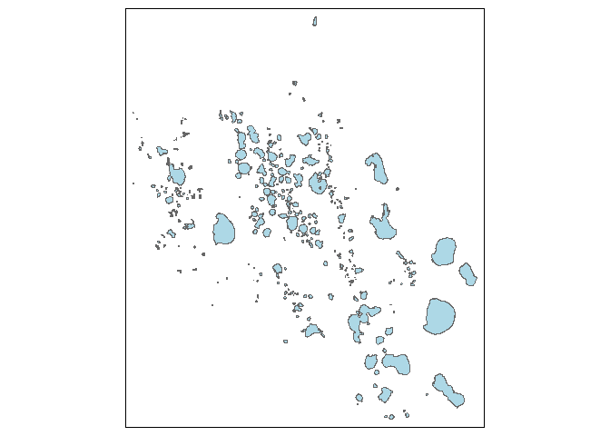

## Loading Packages


```r
library(tidyverse)
library(sf)
library(tmap)
library(plotly)
library(readxl)
library(leaflet)
library(ggrepel)
library(scales)
```


```r
getwd()
```

```
## [1] "C:/Users/Greg_Dills/Desktop/School/Data_Visualization/final_project_repo/dataviz_final_project/project-02"
```


```r
fl_lakes <- read_sf("C:/Users/Greg_Dills/Desktop/School/Data_Visualization/final_project_repo/dataviz_final_project/data/Florida_Lakes/Florida_Lakes/Florida_Lakes.shp")
```


## Successfully read the lake shapefile


```r
head(fl_lakes)
```

<div data-pagedtable="false">
  <script data-pagedtable-source type="application/json">
{"columns":[{"label":["PERIMETER"],"name":[1],"type":["dbl"],"align":["right"]},{"label":["NAME"],"name":[2],"type":["chr"],"align":["left"]},{"label":["COUNTY"],"name":[3],"type":["chr"],"align":["left"]},{"label":["OBJECTID"],"name":[4],"type":["int"],"align":["right"]},{"label":["SHAPEAREA"],"name":[5],"type":["dbl"],"align":["right"]},{"label":["SHAPELEN"],"name":[6],"type":["dbl"],"align":["right"]},{"label":["geometry"],"name":[7],"type":["S3: sfc_MULTIPOLYGON"],"align":["right"]}],"data":[{"1":"11082.2515","2":"Lake Maitland","3":"ORANGE","4":"1","5":"1818000.097","6":"11082.2509","7":"<S3: sfc_MULTIPOLYGON>"},{"1":"2834.0741","2":"Black Lake","3":"ESCAMBIA","4":"2","5":"31379.777","6":"2834.0741","7":"<S3: sfc_MULTIPOLYGON>"},{"1":"18768.2731","2":"Lake Jackson","3":"HIGHLANDS","4":"3","5":"13601177.118","6":"18768.2738","7":"<S3: sfc_MULTIPOLYGON>"},{"1":"493.2790","2":"Halfmoon Lake","3":"ESCAMBIA","4":"4","5":"6337.482","6":"493.2789","7":"<S3: sfc_MULTIPOLYGON>"},{"1":"5662.6876","2":"Crescent Lake","3":"ESCAMBIA","4":"5","5":"338242.234","6":"5662.6887","7":"<S3: sfc_MULTIPOLYGON>"},{"1":"316.9192","2":"Blackfish Lake","3":"SANTA ROSA","4":"6","5":"2379.703","6":"316.9189","7":"<S3: sfc_MULTIPOLYGON>"}],"options":{"columns":{"min":{},"max":[10]},"rows":{"min":[10],"max":[10]},"pages":{}}}
  </script>
</div>


## Dataset Summary


```r
summary(fl_lakes)
```

```
##    PERIMETER            NAME              COUNTY             OBJECTID   
##  Min.   :    55.4   Length:4243        Length:4243        Min.   :   1  
##  1st Qu.:   708.8   Class :character   Class :character   1st Qu.:1062  
##  Median :  1363.6   Mode  :character   Mode  :character   Median :2122  
##  Mean   :  3289.1                                         Mean   :2122  
##  3rd Qu.:  2736.2                                         3rd Qu.:3182  
##  Max.   :421800.0                                         Max.   :4243  
##    SHAPEAREA            SHAPELEN                 geometry   
##  Min.   :1.840e+02   Min.   :    55.4   MULTIPOLYGON :4243  
##  1st Qu.:2.422e+04   1st Qu.:   708.8   epsg:4326    :   0  
##  Median :7.776e+04   Median :  1363.6   +proj=long...:   0  
##  Mean   :1.045e+06   Mean   :  3289.1                       
##  3rd Qu.:2.456e+05   3rd Qu.:  2736.2                       
##  Max.   :1.296e+09   Max.   :421800.0
```


```r
fl_lakes %>% 
  filter(NAME == "Lake Okeechobee")
```

<div data-pagedtable="false">
  <script data-pagedtable-source type="application/json">
{"columns":[{"label":[""],"name":["_rn_"],"type":[""],"align":["left"]},{"label":["PERIMETER"],"name":[1],"type":["dbl"],"align":["right"]},{"label":["NAME"],"name":[2],"type":["chr"],"align":["left"]},{"label":["COUNTY"],"name":[3],"type":["chr"],"align":["left"]},{"label":["OBJECTID"],"name":[4],"type":["int"],"align":["right"]},{"label":["SHAPEAREA"],"name":[5],"type":["dbl"],"align":["right"]},{"label":["SHAPELEN"],"name":[6],"type":["dbl"],"align":["right"]},{"label":["geometry"],"name":[7],"type":["S3: sfc_MULTIPOLYGON"],"align":["right"]}],"data":[{"1":"252240.9","2":"Lake Okeechobee","3":"PALM BEACH","4":"3244","5":"1296120234","6":"252240.9","7":"<S3: sfc_MULTIPOLYGON>","_rn_":"1"}],"options":{"columns":{"min":{},"max":[10]},"rows":{"min":[10],"max":[10]},"pages":{}}}
  </script>
</div>


```r
# Generated summary data by county (Lake count and average perimeter)
fl_lakes_summary <- fl_lakes %>% 
  group_by(COUNTY) %>% 
summarize(Average_Perimeter = mean(PERIMETER), Total_Lakes = n())
```

```
## `summarise()` ungrouping output (override with `.groups` argument)
```

```r
head(fl_lakes_summary)
```

<div data-pagedtable="false">
  <script data-pagedtable-source type="application/json">
{"columns":[{"label":["COUNTY"],"name":[1],"type":["chr"],"align":["left"]},{"label":["Average_Perimeter"],"name":[2],"type":["dbl"],"align":["right"]},{"label":["Total_Lakes"],"name":[3],"type":["int"],"align":["right"]},{"label":["geometry"],"name":[4],"type":["S3: sfc_MULTIPOLYGON"],"align":["right"]}],"data":[{"1":"ALACHUA","2":"5625.724","3":"68","4":"<S3: sfc_MULTIPOLYGON>"},{"1":"BAKER","2":"3493.220","3":"3","4":"<S3: sfc_MULTIPOLYGON>"},{"1":"BAY","2":"5025.152","3":"46","4":"<S3: sfc_MULTIPOLYGON>"},{"1":"BRADFORD","2":"4400.903","3":"11","4":"<S3: sfc_MULTIPOLYGON>"},{"1":"BREVARD","2":"6830.719","3":"35","4":"<S3: sfc_MULTIPOLYGON>"},{"1":"BROWARD","2":"1928.601","3":"32","4":"<S3: sfc_MULTIPOLYGON>"}],"options":{"columns":{"min":{},"max":[10]},"rows":{"min":[10],"max":[10]},"pages":{}}}
  </script>
</div>

## Data Exploration


```r
#Reviewing the summary data, ensuring that it makes sense. Palm Beach does contain the largest lake (Lake Okeechobee), thus the average perimeter makes sense. However, I am not familiar with Monroe County and intend to explore further.

fl_lakes_summary %>% 
    arrange(desc(Average_Perimeter))
```

<div data-pagedtable="false">
  <script data-pagedtable-source type="application/json">
{"columns":[{"label":["COUNTY"],"name":[1],"type":["chr"],"align":["left"]},{"label":["Average_Perimeter"],"name":[2],"type":["dbl"],"align":["right"]},{"label":["Total_Lakes"],"name":[3],"type":["int"],"align":["right"]},{"label":["geometry"],"name":[4],"type":["S3: sfc_MULTIPOLYGON"],"align":["right"]}],"data":[{"1":"PALM BEACH","2":"24969.8873","3":"19","4":"<S3: sfc_MULTIPOLYGON>"},{"1":"MONROE","2":"24045.1026","3":"26","4":"<S3: sfc_MULTIPOLYGON>"},{"1":"CITRUS","2":"18064.6597","3":"27","4":"<S3: sfc_MULTIPOLYGON>"},{"1":"OSCEOLA","2":"10941.2968","3":"56","4":"<S3: sfc_MULTIPOLYGON>"},{"1":"INDIAN RIVER","2":"10895.5118","3":"2","4":"<S3: sfc_MULTIPOLYGON>"},{"1":"GULF","2":"9163.6585","3":"11","4":"<S3: sfc_MULTIPOLYGON>"},{"1":"GADSDEN","2":"9100.8794","3":"21","4":"<S3: sfc_MULTIPOLYGON>"},{"1":"BREVARD","2":"6830.7193","3":"35","4":"<S3: sfc_MULTIPOLYGON>"},{"1":"LEE","2":"6041.2762","3":"15","4":"<S3: sfc_MULTIPOLYGON>"},{"1":"ALACHUA","2":"5625.7241","3":"68","4":"<S3: sfc_MULTIPOLYGON>"},{"1":"UNION","2":"5529.3329","3":"4","4":"<S3: sfc_MULTIPOLYGON>"},{"1":"JACKSON","2":"5415.1530","3":"108","4":"<S3: sfc_MULTIPOLYGON>"},{"1":"BAY","2":"5025.1517","3":"46","4":"<S3: sfc_MULTIPOLYGON>"},{"1":"MARTIN","2":"4951.7887","3":"8","4":"<S3: sfc_MULTIPOLYGON>"},{"1":"ST. JOHN","2":"4948.9120","3":"3","4":"<S3: sfc_MULTIPOLYGON>"},{"1":"HIGHLANDS","2":"4624.9197","3":"78","4":"<S3: sfc_MULTIPOLYGON>"},{"1":"BRADFORD","2":"4400.9030","3":"11","4":"<S3: sfc_MULTIPOLYGON>"},{"1":"MANATEE","2":"4369.8648","3":"9","4":"<S3: sfc_MULTIPOLYGON>"},{"1":"LEON","2":"3899.3111","3":"105","4":"<S3: sfc_MULTIPOLYGON>"},{"1":"VOLUSIA","2":"3894.7223","3":"166","4":"<S3: sfc_MULTIPOLYGON>"},{"1":"MIAMI-DADE","2":"3773.5393","3":"85","4":"<S3: sfc_MULTIPOLYGON>"},{"1":"SARASOTA","2":"3516.7353","3":"12","4":"<S3: sfc_MULTIPOLYGON>"},{"1":"BAKER","2":"3493.2203","3":"3","4":"<S3: sfc_MULTIPOLYGON>"},{"1":"GLADES","2":"3453.9849","3":"7","4":"<S3: sfc_MULTIPOLYGON>"},{"1":"MARION","2":"3417.5045","3":"199","4":"<S3: sfc_MULTIPOLYGON>"},{"1":"POLK","2":"3301.0486","3":"309","4":"<S3: sfc_MULTIPOLYGON>"},{"1":"CLAY","2":"3100.3718","3":"62","4":"<S3: sfc_MULTIPOLYGON>"},{"1":"LEVY","2":"3098.4802","3":"47","4":"<S3: sfc_MULTIPOLYGON>"},{"1":"FLAGLER","2":"3088.3386","3":"12","4":"<S3: sfc_MULTIPOLYGON>"},{"1":"PINELLAS","2":"3048.8385","3":"40","4":"<S3: sfc_MULTIPOLYGON>"},{"1":"LAKE","2":"2870.7412","3":"396","4":"<S3: sfc_MULTIPOLYGON>"},{"1":"NASSAU","2":"2837.9903","3":"1","4":"<S3: sfc_MULTIPOLYGON>"},{"1":"SUMTER","2":"2759.2178","3":"58","4":"<S3: sfc_MULTIPOLYGON>"},{"1":"OKEECHOBEE","2":"2712.8112","3":"2","4":"<S3: sfc_MULTIPOLYGON>"},{"1":"ORANGE","2":"2680.7438","3":"365","4":"<S3: sfc_MULTIPOLYGON>"},{"1":"JEFFERSON","2":"2611.1539","3":"41","4":"<S3: sfc_MULTIPOLYGON>"},{"1":"HERNANDO","2":"2567.8323","3":"74","4":"<S3: sfc_MULTIPOLYGON>"},{"1":"PUTNAM","2":"2559.9580","3":"162","4":"<S3: sfc_MULTIPOLYGON>"},{"1":"SEMINOLE","2":"2230.2726","3":"152","4":"<S3: sfc_MULTIPOLYGON>"},{"1":"PASCO","2":"2201.2976","3":"165","4":"<S3: sfc_MULTIPOLYGON>"},{"1":"COLUMBIA","2":"2163.7743","3":"31","4":"<S3: sfc_MULTIPOLYGON>"},{"1":"DESOTO","2":"2083.9812","3":"13","4":"<S3: sfc_MULTIPOLYGON>"},{"1":"ESCAMBIA","2":"2032.1626","3":"23","4":"<S3: sfc_MULTIPOLYGON>"},{"1":"ST. LUCIE","2":"2002.4372","3":"3","4":"<S3: sfc_MULTIPOLYGON>"},{"1":"BROWARD","2":"1928.6011","3":"32","4":"<S3: sfc_MULTIPOLYGON>"},{"1":"WASHINGTON","2":"1920.8225","3":"228","4":"<S3: sfc_MULTIPOLYGON>"},{"1":"MADISON","2":"1920.7883","3":"73","4":"<S3: sfc_MULTIPOLYGON>"},{"1":"HARDEE","2":"1906.1213","3":"3","4":"<S3: sfc_MULTIPOLYGON>"},{"1":"WALTON","2":"1895.8126","3":"80","4":"<S3: sfc_MULTIPOLYGON>"},{"1":"WAKULLA","2":"1881.6954","3":"46","4":"<S3: sfc_MULTIPOLYGON>"},{"1":"HILLSBOROUGH","2":"1836.4120","3":"143","4":"<S3: sfc_MULTIPOLYGON>"},{"1":"FRANKLIN","2":"1795.4014","3":"27","4":"<S3: sfc_MULTIPOLYGON>"},{"1":"TAYLOR","2":"1665.7160","3":"31","4":"<S3: sfc_MULTIPOLYGON>"},{"1":"LAFAYETTE","2":"1646.7918","3":"37","4":"<S3: sfc_MULTIPOLYGON>"},{"1":"DIXIE","2":"1582.3673","3":"44","4":"<S3: sfc_MULTIPOLYGON>"},{"1":"COLLIER","2":"1529.0946","3":"14","4":"<S3: sfc_MULTIPOLYGON>"},{"1":"GILCHRIST","2":"1524.2151","3":"69","4":"<S3: sfc_MULTIPOLYGON>"},{"1":"HAMILTON","2":"1511.2594","3":"17","4":"<S3: sfc_MULTIPOLYGON>"},{"1":"CALHOUN","2":"1372.5795","3":"26","4":"<S3: sfc_MULTIPOLYGON>"},{"1":"CHARLOTTE","2":"1299.8376","3":"20","4":"<S3: sfc_MULTIPOLYGON>"},{"1":"OKALOOSA","2":"1289.1398","3":"73","4":"<S3: sfc_MULTIPOLYGON>"},{"1":"LIBERTY","2":"1275.9880","3":"32","4":"<S3: sfc_MULTIPOLYGON>"},{"1":"SANTA ROSA","2":"1191.8806","3":"46","4":"<S3: sfc_MULTIPOLYGON>"},{"1":"SUWANNEE","2":"1127.3785","3":"39","4":"<S3: sfc_MULTIPOLYGON>"},{"1":"DUVAL","2":"866.7559","3":"13","4":"<S3: sfc_MULTIPOLYGON>"},{"1":"HOLMES","2":"821.1030","3":"68","4":"<S3: sfc_MULTIPOLYGON>"},{"1":"HENDRY","2":"799.8395","3":"2","4":"<S3: sfc_MULTIPOLYGON>"}],"options":{"columns":{"min":{},"max":[10]},"rows":{"min":[10],"max":[10]},"pages":{}}}
  </script>
</div>


[Link to "The Cutoff" lake visual](https://geodata.dep.state.fl.us/datasets/97b765ff2b70400d8bcab23fbe2a5e88_0/data?geometry=-81.214%2C25.183%2C-80.567%2C25.400&where=NAME%20%3D%20%27The%20Cutoff%27)


```r
# Interestingly enough, Monroe county is where the Everglades reside and many of the "lakes" in this county, I would not have considered them to be classified as lakes. For example, "The Cutoff" appears to be more like a river/estuary system. A graphical representation can be found in the link above. After reading more about the meta data, the observations can also be reservoirs.


fl_lakes %>% 
  filter(COUNTY == "MONROE")
```

<div data-pagedtable="false">
  <script data-pagedtable-source type="application/json">
{"columns":[{"label":[""],"name":["_rn_"],"type":[""],"align":["left"]},{"label":["PERIMETER"],"name":[1],"type":["dbl"],"align":["right"]},{"label":["NAME"],"name":[2],"type":["chr"],"align":["left"]},{"label":["COUNTY"],"name":[3],"type":["chr"],"align":["left"]},{"label":["OBJECTID"],"name":[4],"type":["int"],"align":["right"]},{"label":["SHAPEAREA"],"name":[5],"type":["dbl"],"align":["right"]},{"label":["SHAPELEN"],"name":[6],"type":["dbl"],"align":["right"]},{"label":["geometry"],"name":[7],"type":["S3: sfc_MULTIPOLYGON"],"align":["right"]}],"data":[{"1":"330469.36810","2":"The Cutoff","3":"MONROE","4":"63","5":"1.194238e+07","6":"330469.37378","7":"<S3: sfc_MULTIPOLYGON>","_rn_":"1"},{"1":"6803.85543","2":"Cattail Lakes","3":"MONROE","4":"486","5":"5.881219e+05","6":"6803.85804","7":"<S3: sfc_MULTIPOLYGON>","_rn_":"2"},{"1":"4980.53095","2":"Middle Fox Lake","3":"MONROE","4":"822","5":"1.302546e+06","6":"4980.53005","7":"<S3: sfc_MULTIPOLYGON>","_rn_":"3"},{"1":"181206.20581","2":"Raulerson Prairie","3":"MONROE","4":"928","5":"1.534068e+07","6":"181206.20394","7":"<S3: sfc_MULTIPOLYGON>","_rn_":"4"},{"1":"14248.59418","2":"Bear Lake","3":"MONROE","4":"929","5":"4.215211e+06","6":"14248.59600","7":"<S3: sfc_MULTIPOLYGON>","_rn_":"5"},{"1":"909.62182","2":"Coot Bay Pond","3":"MONROE","4":"1263","5":"3.598062e+04","6":"909.62220","7":"<S3: sfc_MULTIPOLYGON>","_rn_":"6"},{"1":"2661.46910","2":"Lake Simmons","3":"MONROE","4":"1270","5":"2.651502e+05","6":"2661.46993","7":"<S3: sfc_MULTIPOLYGON>","_rn_":"7"},{"1":"2495.50940","2":"Little Fox Lake","3":"MONROE","4":"1361","5":"3.014335e+05","6":"2495.50906","7":"<S3: sfc_MULTIPOLYGON>","_rn_":"8"},{"1":"3896.96319","2":"East Fox Lake","3":"MONROE","4":"1635","5":"7.396481e+05","6":"3896.96188","7":"<S3: sfc_MULTIPOLYGON>","_rn_":"9"},{"1":"2652.78593","2":"Dove Sound","3":"MONROE","4":"1641","5":"9.552257e+04","6":"2652.78575","7":"<S3: sfc_MULTIPOLYGON>","_rn_":"10"},{"1":"13219.24571","2":"Tarpon Creek","3":"MONROE","4":"1979","5":"4.480371e+06","6":"13219.24290","7":"<S3: sfc_MULTIPOLYGON>","_rn_":"11"},{"1":"3265.96451","2":"Crocodile Lake","3":"MONROE","4":"2149","5":"1.628604e+05","6":"3265.96364","7":"<S3: sfc_MULTIPOLYGON>","_rn_":"12"},{"1":"7055.77013","2":"Mud Lake","3":"MONROE","4":"2153","5":"1.338250e+06","6":"7055.77153","7":"<S3: sfc_MULTIPOLYGON>","_rn_":"13"},{"1":"1647.11817","2":"Mud Lakes","3":"MONROE","4":"2640","5":"8.986380e+04","6":"1647.11814","7":"<S3: sfc_MULTIPOLYGON>","_rn_":"14"},{"1":"1025.04917","2":"Big Boy Lake","3":"MONROE","4":"2714","5":"4.134542e+04","6":"1025.04984","7":"<S3: sfc_MULTIPOLYGON>","_rn_":"15"},{"1":"7449.45255","2":"Lake Surprise","3":"MONROE","4":"2722","5":"1.837923e+06","6":"7449.45609","7":"<S3: sfc_MULTIPOLYGON>","_rn_":"16"},{"1":"1691.52133","2":"Southwater","3":"MONROE","4":"3050","5":"1.125374e+05","6":"1691.52218","7":"<S3: sfc_MULTIPOLYGON>","_rn_":"17"},{"1":"236.48821","2":"Lake Ingraham","3":"MONROE","4":"3241","5":"1.795954e+03","6":"236.48862","7":"<S3: sfc_MULTIPOLYGON>","_rn_":"18"},{"1":"190.08675","2":"Lake Ingraham","3":"MONROE","4":"3629","5":"1.066858e+03","6":"190.08695","7":"<S3: sfc_MULTIPOLYGON>","_rn_":"19"},{"1":"248.99579","2":"Lake Ingraham","3":"MONROE","4":"3654","5":"1.459195e+03","6":"248.99548","7":"<S3: sfc_MULTIPOLYGON>","_rn_":"20"},{"1":"21795.05305","2":"Lake Ingraham","3":"MONROE","4":"3655","5":"7.708058e+06","6":"21795.05410","7":"<S3: sfc_MULTIPOLYGON>","_rn_":"21"},{"1":"14947.67442","2":"Gator Lake","3":"MONROE","4":"3933","5":"1.923456e+06","6":"14947.67742","7":"<S3: sfc_MULTIPOLYGON>","_rn_":"22"},{"1":"338.58711","2":"Mrazek Pond","3":"MONROE","4":"3934","5":"5.985688e+03","6":"338.58704","7":"<S3: sfc_MULTIPOLYGON>","_rn_":"23"},{"1":"115.96380","2":"Lake Ingraham","3":"MONROE","4":"3946","5":"6.068412e+02","6":"115.96417","7":"<S3: sfc_MULTIPOLYGON>","_rn_":"24"},{"1":"55.37565","2":"Weeks Lakes","3":"MONROE","4":"4215","5":"1.835052e+02","6":"55.37512","7":"<S3: sfc_MULTIPOLYGON>","_rn_":"25"},{"1":"1565.41863","2":"Weeks Lakes","3":"MONROE","4":"4216","5":"4.030679e+04","6":"1565.41791","7":"<S3: sfc_MULTIPOLYGON>","_rn_":"26"}],"options":{"columns":{"min":{},"max":[10]},"rows":{"min":[10],"max":[10]},"pages":{}}}
  </script>
</div>

## Interactive Bar Plot


```r
# Creating an interactive bar plot to explore which counties have the largest (on average) lakes.

bar_plot <- ggplot(fl_lakes_summary, aes(reorder(COUNTY, -Average_Perimeter), Average_Perimeter)) +
  geom_col(aes(fill = Average_Perimeter)) +
  scale_fill_gradient(low = "grey", 
                       high = "blue") +
  theme_minimal() + 
  theme(plot.title = element_text(size=12)) +
  theme(axis.title.x=element_blank(),
        axis.text.x=element_blank(),
        axis.ticks.x=element_blank()) +
  labs(title = "Distribution of Average Florida Lake Size by County") 
  geom_label(aes(label = COUNTY))
```

```
## mapping: label = ~COUNTY 
## geom_label: parse = FALSE, label.padding = 0.25, label.r = 0.15, label.size = 0.25, na.rm = FALSE
## stat_identity: na.rm = FALSE
## position_identity
```

```r
ggplotly(bar_plot)
```

<!--html_preserve--><div id="htmlwidget-6150b3ce21075c8b5153" style="width:672px;height:480px;" class="plotly html-widget"></div>
<script type="application/json" data-for="htmlwidget-6150b3ce21075c8b5153">{"x":{"data":[{"orientation":"v","width":0.900000000000006,"base":0,"x":[67],"y":[799.8394784],"text":"Average_Perimeter:   799.8395<br />reorder(COUNTY, -Average_Perimeter): HENDRY<br />Average_Perimeter:   799.8395","type":"bar","marker":{"autocolorscale":false,"color":"rgba(190,190,190,1)","line":{"width":1.88976377952756,"color":"transparent"}},"showlegend":false,"xaxis":"x","yaxis":"y","hoverinfo":"text","frame":null},{"orientation":"v","width":0.900000000000006,"base":0,"x":[66],"y":[821.102979893824],"text":"Average_Perimeter:   821.1030<br />reorder(COUNTY, -Average_Perimeter): HOLMES<br />Average_Perimeter:   821.1030","type":"bar","marker":{"autocolorscale":false,"color":"rgba(190,190,190,1)","line":{"width":1.88976377952756,"color":"transparent"}},"showlegend":false,"xaxis":"x","yaxis":"y","hoverinfo":"text","frame":null},{"orientation":"v","width":0.900000000000006,"base":0,"x":[65],"y":[866.755899306923],"text":"Average_Perimeter:   866.7559<br />reorder(COUNTY, -Average_Perimeter): DUVAL<br />Average_Perimeter:   866.7559","type":"bar","marker":{"autocolorscale":false,"color":"rgba(190,190,190,1)","line":{"width":1.88976377952756,"color":"transparent"}},"showlegend":false,"xaxis":"x","yaxis":"y","hoverinfo":"text","frame":null},{"orientation":"v","width":0.900000000000006,"base":0,"x":[64],"y":[1127.37852302564],"text":"Average_Perimeter:  1127.3785<br />reorder(COUNTY, -Average_Perimeter): SUWANNEE<br />Average_Perimeter:  1127.3785","type":"bar","marker":{"autocolorscale":false,"color":"rgba(189,188,191,1)","line":{"width":1.88976377952756,"color":"transparent"}},"showlegend":false,"xaxis":"x","yaxis":"y","hoverinfo":"text","frame":null},{"orientation":"v","width":0.900000000000006,"base":0,"x":[63],"y":[1191.88057223413],"text":"Average_Perimeter:  1191.8806<br />reorder(COUNTY, -Average_Perimeter): SANTA ROSA<br />Average_Perimeter:  1191.8806","type":"bar","marker":{"autocolorscale":false,"color":"rgba(189,187,191,1)","line":{"width":1.88976377952756,"color":"transparent"}},"showlegend":false,"xaxis":"x","yaxis":"y","hoverinfo":"text","frame":null},{"orientation":"v","width":0.900000000000006,"base":0,"x":[62],"y":[1275.98803201625],"text":"Average_Perimeter:  1275.9880<br />reorder(COUNTY, -Average_Perimeter): LIBERTY<br />Average_Perimeter:  1275.9880","type":"bar","marker":{"autocolorscale":false,"color":"rgba(189,187,192,1)","line":{"width":1.88976377952756,"color":"transparent"}},"showlegend":false,"xaxis":"x","yaxis":"y","hoverinfo":"text","frame":null},{"orientation":"v","width":0.900000000000006,"base":0,"x":[61],"y":[1289.13981695575],"text":"Average_Perimeter:  1289.1398<br />reorder(COUNTY, -Average_Perimeter): OKALOOSA<br />Average_Perimeter:  1289.1398","type":"bar","marker":{"autocolorscale":false,"color":"rgba(189,187,192,1)","line":{"width":1.88976377952756,"color":"transparent"}},"showlegend":false,"xaxis":"x","yaxis":"y","hoverinfo":"text","frame":null},{"orientation":"v","width":0.900000000000006,"base":0,"x":[60],"y":[1299.837626498],"text":"Average_Perimeter:  1299.8376<br />reorder(COUNTY, -Average_Perimeter): CHARLOTTE<br />Average_Perimeter:  1299.8376","type":"bar","marker":{"autocolorscale":false,"color":"rgba(189,187,192,1)","line":{"width":1.88976377952756,"color":"transparent"}},"showlegend":false,"xaxis":"x","yaxis":"y","hoverinfo":"text","frame":null},{"orientation":"v","width":0.900000000000006,"base":0,"x":[59],"y":[1372.57945308308],"text":"Average_Perimeter:  1372.5795<br />reorder(COUNTY, -Average_Perimeter): CALHOUN<br />Average_Perimeter:  1372.5795","type":"bar","marker":{"autocolorscale":false,"color":"rgba(189,186,192,1)","line":{"width":1.88976377952756,"color":"transparent"}},"showlegend":false,"xaxis":"x","yaxis":"y","hoverinfo":"text","frame":null},{"orientation":"v","width":0.900000000000006,"base":0,"x":[58],"y":[1511.25938316647],"text":"Average_Perimeter:  1511.2594<br />reorder(COUNTY, -Average_Perimeter): HAMILTON<br />Average_Perimeter:  1511.2594","type":"bar","marker":{"autocolorscale":false,"color":"rgba(188,185,192,1)","line":{"width":1.88976377952756,"color":"transparent"}},"showlegend":false,"xaxis":"x","yaxis":"y","hoverinfo":"text","frame":null},{"orientation":"v","width":0.900000000000006,"base":0,"x":[57],"y":[1524.21510594667],"text":"Average_Perimeter:  1524.2151<br />reorder(COUNTY, -Average_Perimeter): GILCHRIST<br />Average_Perimeter:  1524.2151","type":"bar","marker":{"autocolorscale":false,"color":"rgba(188,185,192,1)","line":{"width":1.88976377952756,"color":"transparent"}},"showlegend":false,"xaxis":"x","yaxis":"y","hoverinfo":"text","frame":null},{"orientation":"v","width":0.900000000000006,"base":0,"x":[56],"y":[1529.09463417286],"text":"Average_Perimeter:  1529.0946<br />reorder(COUNTY, -Average_Perimeter): COLLIER<br />Average_Perimeter:  1529.0946","type":"bar","marker":{"autocolorscale":false,"color":"rgba(188,185,192,1)","line":{"width":1.88976377952756,"color":"transparent"}},"showlegend":false,"xaxis":"x","yaxis":"y","hoverinfo":"text","frame":null},{"orientation":"v","width":0.900000000000006,"base":0,"x":[55],"y":[1582.36726939886],"text":"Average_Perimeter:  1582.3673<br />reorder(COUNTY, -Average_Perimeter): DIXIE<br />Average_Perimeter:  1582.3673","type":"bar","marker":{"autocolorscale":false,"color":"rgba(188,185,192,1)","line":{"width":1.88976377952756,"color":"transparent"}},"showlegend":false,"xaxis":"x","yaxis":"y","hoverinfo":"text","frame":null},{"orientation":"v","width":0.900000000000006,"base":0,"x":[54],"y":[1646.79177320216],"text":"Average_Perimeter:  1646.7918<br />reorder(COUNTY, -Average_Perimeter): LAFAYETTE<br />Average_Perimeter:  1646.7918","type":"bar","marker":{"autocolorscale":false,"color":"rgba(188,184,193,1)","line":{"width":1.88976377952756,"color":"transparent"}},"showlegend":false,"xaxis":"x","yaxis":"y","hoverinfo":"text","frame":null},{"orientation":"v","width":0.900000000000006,"base":0,"x":[53],"y":[1665.71601425226],"text":"Average_Perimeter:  1665.7160<br />reorder(COUNTY, -Average_Perimeter): TAYLOR<br />Average_Perimeter:  1665.7160","type":"bar","marker":{"autocolorscale":false,"color":"rgba(188,184,193,1)","line":{"width":1.88976377952756,"color":"transparent"}},"showlegend":false,"xaxis":"x","yaxis":"y","hoverinfo":"text","frame":null},{"orientation":"v","width":0.900000000000006,"base":0,"x":[52],"y":[1795.40139316148],"text":"Average_Perimeter:  1795.4014<br />reorder(COUNTY, -Average_Perimeter): FRANKLIN<br />Average_Perimeter:  1795.4014","type":"bar","marker":{"autocolorscale":false,"color":"rgba(187,183,193,1)","line":{"width":1.88976377952756,"color":"transparent"}},"showlegend":false,"xaxis":"x","yaxis":"y","hoverinfo":"text","frame":null},{"orientation":"v","width":0.900000000000006,"base":0,"x":[51],"y":[1836.41196068308],"text":"Average_Perimeter:  1836.4120<br />reorder(COUNTY, -Average_Perimeter): HILLSBOROUGH<br />Average_Perimeter:  1836.4120","type":"bar","marker":{"autocolorscale":false,"color":"rgba(187,183,193,1)","line":{"width":1.88976377952756,"color":"transparent"}},"showlegend":false,"xaxis":"x","yaxis":"y","hoverinfo":"text","frame":null},{"orientation":"v","width":0.900000000000006,"base":0,"x":[50],"y":[1881.69536627848],"text":"Average_Perimeter:  1881.6954<br />reorder(COUNTY, -Average_Perimeter): WAKULLA<br />Average_Perimeter:  1881.6954","type":"bar","marker":{"autocolorscale":false,"color":"rgba(187,183,193,1)","line":{"width":1.88976377952756,"color":"transparent"}},"showlegend":false,"xaxis":"x","yaxis":"y","hoverinfo":"text","frame":null},{"orientation":"v","width":0.900000000000006,"base":0,"x":[49],"y":[1895.81258946213],"text":"Average_Perimeter:  1895.8126<br />reorder(COUNTY, -Average_Perimeter): WALTON<br />Average_Perimeter:  1895.8126","type":"bar","marker":{"autocolorscale":false,"color":"rgba(187,183,193,1)","line":{"width":1.88976377952756,"color":"transparent"}},"showlegend":false,"xaxis":"x","yaxis":"y","hoverinfo":"text","frame":null},{"orientation":"v","width":0.900000000000006,"base":0,"x":[48],"y":[1906.12130901667],"text":"Average_Perimeter:  1906.1213<br />reorder(COUNTY, -Average_Perimeter): HARDEE<br />Average_Perimeter:  1906.1213","type":"bar","marker":{"autocolorscale":false,"color":"rgba(187,183,194,1)","line":{"width":1.88976377952756,"color":"transparent"}},"showlegend":false,"xaxis":"x","yaxis":"y","hoverinfo":"text","frame":null},{"orientation":"v","width":0.900000000000006,"base":0,"x":[47],"y":[1920.78832061301],"text":"Average_Perimeter:  1920.7883<br />reorder(COUNTY, -Average_Perimeter): MADISON<br />Average_Perimeter:  1920.7883","type":"bar","marker":{"autocolorscale":false,"color":"rgba(187,183,194,1)","line":{"width":1.88976377952756,"color":"transparent"}},"showlegend":false,"xaxis":"x","yaxis":"y","hoverinfo":"text","frame":null},{"orientation":"v","width":0.900000000000006,"base":0,"x":[46],"y":[1920.82246941311],"text":"Average_Perimeter:  1920.8225<br />reorder(COUNTY, -Average_Perimeter): WASHINGTON<br />Average_Perimeter:  1920.8225","type":"bar","marker":{"autocolorscale":false,"color":"rgba(187,183,194,1)","line":{"width":1.88976377952756,"color":"transparent"}},"showlegend":false,"xaxis":"x","yaxis":"y","hoverinfo":"text","frame":null},{"orientation":"v","width":0.900000000000006,"base":0,"x":[45],"y":[1928.60107958875],"text":"Average_Perimeter:  1928.6011<br />reorder(COUNTY, -Average_Perimeter): BROWARD<br />Average_Perimeter:  1928.6011","type":"bar","marker":{"autocolorscale":false,"color":"rgba(187,182,194,1)","line":{"width":1.88976377952756,"color":"transparent"}},"showlegend":false,"xaxis":"x","yaxis":"y","hoverinfo":"text","frame":null},{"orientation":"v","width":0.900000000000006,"base":0,"x":[44],"y":[2002.43718425333],"text":"Average_Perimeter:  2002.4372<br />reorder(COUNTY, -Average_Perimeter): ST. LUCIE<br />Average_Perimeter:  2002.4372","type":"bar","marker":{"autocolorscale":false,"color":"rgba(187,182,194,1)","line":{"width":1.88976377952756,"color":"transparent"}},"showlegend":false,"xaxis":"x","yaxis":"y","hoverinfo":"text","frame":null},{"orientation":"v","width":0.900000000000006,"base":0,"x":[43],"y":[2032.1625630887],"text":"Average_Perimeter:  2032.1626<br />reorder(COUNTY, -Average_Perimeter): ESCAMBIA<br />Average_Perimeter:  2032.1626","type":"bar","marker":{"autocolorscale":false,"color":"rgba(187,182,194,1)","line":{"width":1.88976377952756,"color":"transparent"}},"showlegend":false,"xaxis":"x","yaxis":"y","hoverinfo":"text","frame":null},{"orientation":"v","width":0.900000000000006,"base":0,"x":[42],"y":[2083.98123051615],"text":"Average_Perimeter:  2083.9812<br />reorder(COUNTY, -Average_Perimeter): DESOTO<br />Average_Perimeter:  2083.9812","type":"bar","marker":{"autocolorscale":false,"color":"rgba(187,181,194,1)","line":{"width":1.88976377952756,"color":"transparent"}},"showlegend":false,"xaxis":"x","yaxis":"y","hoverinfo":"text","frame":null},{"orientation":"v","width":0.900000000000006,"base":0,"x":[41],"y":[2163.77430988064],"text":"Average_Perimeter:  2163.7743<br />reorder(COUNTY, -Average_Perimeter): COLUMBIA<br />Average_Perimeter:  2163.7743","type":"bar","marker":{"autocolorscale":false,"color":"rgba(186,181,194,1)","line":{"width":1.88976377952756,"color":"transparent"}},"showlegend":false,"xaxis":"x","yaxis":"y","hoverinfo":"text","frame":null},{"orientation":"v","width":0.900000000000006,"base":0,"x":[40],"y":[2201.29758783606],"text":"Average_Perimeter:  2201.2976<br />reorder(COUNTY, -Average_Perimeter): PASCO<br />Average_Perimeter:  2201.2976","type":"bar","marker":{"autocolorscale":false,"color":"rgba(186,181,194,1)","line":{"width":1.88976377952756,"color":"transparent"}},"showlegend":false,"xaxis":"x","yaxis":"y","hoverinfo":"text","frame":null},{"orientation":"v","width":0.900000000000006,"base":0,"x":[39],"y":[2230.27262495678],"text":"Average_Perimeter:  2230.2726<br />reorder(COUNTY, -Average_Perimeter): SEMINOLE<br />Average_Perimeter:  2230.2726","type":"bar","marker":{"autocolorscale":false,"color":"rgba(186,180,195,1)","line":{"width":1.88976377952756,"color":"transparent"}},"showlegend":false,"xaxis":"x","yaxis":"y","hoverinfo":"text","frame":null},{"orientation":"v","width":0.900000000000006,"base":0,"x":[38],"y":[2559.95802341673],"text":"Average_Perimeter:  2559.9580<br />reorder(COUNTY, -Average_Perimeter): PUTNAM<br />Average_Perimeter:  2559.9580","type":"bar","marker":{"autocolorscale":false,"color":"rgba(185,178,196,1)","line":{"width":1.88976377952756,"color":"transparent"}},"showlegend":false,"xaxis":"x","yaxis":"y","hoverinfo":"text","frame":null},{"orientation":"v","width":0.900000000000006,"base":0,"x":[37],"y":[2567.83233737838],"text":"Average_Perimeter:  2567.8323<br />reorder(COUNTY, -Average_Perimeter): HERNANDO<br />Average_Perimeter:  2567.8323","type":"bar","marker":{"autocolorscale":false,"color":"rgba(185,178,196,1)","line":{"width":1.88976377952756,"color":"transparent"}},"showlegend":false,"xaxis":"x","yaxis":"y","hoverinfo":"text","frame":null},{"orientation":"v","width":0.900000000000006,"base":0,"x":[36],"y":[2611.1538704761],"text":"Average_Perimeter:  2611.1539<br />reorder(COUNTY, -Average_Perimeter): JEFFERSON<br />Average_Perimeter:  2611.1539","type":"bar","marker":{"autocolorscale":false,"color":"rgba(185,178,196,1)","line":{"width":1.88976377952756,"color":"transparent"}},"showlegend":false,"xaxis":"x","yaxis":"y","hoverinfo":"text","frame":null},{"orientation":"v","width":0.900000000000006,"base":0,"x":[35],"y":[2680.74376788033],"text":"Average_Perimeter:  2680.7438<br />reorder(COUNTY, -Average_Perimeter): ORANGE<br />Average_Perimeter:  2680.7438","type":"bar","marker":{"autocolorscale":false,"color":"rgba(185,177,196,1)","line":{"width":1.88976377952756,"color":"transparent"}},"showlegend":false,"xaxis":"x","yaxis":"y","hoverinfo":"text","frame":null},{"orientation":"v","width":0.900000000000006,"base":0,"x":[34],"y":[2712.811154505],"text":"Average_Perimeter:  2712.8112<br />reorder(COUNTY, -Average_Perimeter): OKEECHOBEE<br />Average_Perimeter:  2712.8112","type":"bar","marker":{"autocolorscale":false,"color":"rgba(185,177,196,1)","line":{"width":1.88976377952756,"color":"transparent"}},"showlegend":false,"xaxis":"x","yaxis":"y","hoverinfo":"text","frame":null},{"orientation":"v","width":0.900000000000006,"base":0,"x":[33],"y":[2759.21780001569],"text":"Average_Perimeter:  2759.2178<br />reorder(COUNTY, -Average_Perimeter): SUMTER<br />Average_Perimeter:  2759.2178","type":"bar","marker":{"autocolorscale":false,"color":"rgba(185,177,196,1)","line":{"width":1.88976377952756,"color":"transparent"}},"showlegend":false,"xaxis":"x","yaxis":"y","hoverinfo":"text","frame":null},{"orientation":"v","width":0.900000000000002,"base":0,"x":[32],"y":[2837.99033936],"text":"Average_Perimeter:  2837.9903<br />reorder(COUNTY, -Average_Perimeter): NASSAU<br />Average_Perimeter:  2837.9903","type":"bar","marker":{"autocolorscale":false,"color":"rgba(185,176,196,1)","line":{"width":1.88976377952756,"color":"transparent"}},"showlegend":false,"xaxis":"x","yaxis":"y","hoverinfo":"text","frame":null},{"orientation":"v","width":0.899999999999999,"base":0,"x":[31],"y":[2870.74120635417],"text":"Average_Perimeter:  2870.7412<br />reorder(COUNTY, -Average_Perimeter): LAKE<br />Average_Perimeter:  2870.7412","type":"bar","marker":{"autocolorscale":false,"color":"rgba(184,176,197,1)","line":{"width":1.88976377952756,"color":"transparent"}},"showlegend":false,"xaxis":"x","yaxis":"y","hoverinfo":"text","frame":null},{"orientation":"v","width":0.899999999999999,"base":0,"x":[30],"y":[3048.838514413],"text":"Average_Perimeter:  3048.8385<br />reorder(COUNTY, -Average_Perimeter): PINELLAS<br />Average_Perimeter:  3048.8385","type":"bar","marker":{"autocolorscale":false,"color":"rgba(184,175,197,1)","line":{"width":1.88976377952756,"color":"transparent"}},"showlegend":false,"xaxis":"x","yaxis":"y","hoverinfo":"text","frame":null},{"orientation":"v","width":0.899999999999999,"base":0,"x":[29],"y":[3088.33858651],"text":"Average_Perimeter:  3088.3386<br />reorder(COUNTY, -Average_Perimeter): FLAGLER<br />Average_Perimeter:  3088.3386","type":"bar","marker":{"autocolorscale":false,"color":"rgba(184,175,197,1)","line":{"width":1.88976377952756,"color":"transparent"}},"showlegend":false,"xaxis":"x","yaxis":"y","hoverinfo":"text","frame":null},{"orientation":"v","width":0.899999999999999,"base":0,"x":[28],"y":[3098.48016514936],"text":"Average_Perimeter:  3098.4802<br />reorder(COUNTY, -Average_Perimeter): LEVY<br />Average_Perimeter:  3098.4802","type":"bar","marker":{"autocolorscale":false,"color":"rgba(184,175,197,1)","line":{"width":1.88976377952756,"color":"transparent"}},"showlegend":false,"xaxis":"x","yaxis":"y","hoverinfo":"text","frame":null},{"orientation":"v","width":0.899999999999999,"base":0,"x":[27],"y":[3100.37179369548],"text":"Average_Perimeter:  3100.3718<br />reorder(COUNTY, -Average_Perimeter): CLAY<br />Average_Perimeter:  3100.3718","type":"bar","marker":{"autocolorscale":false,"color":"rgba(184,175,197,1)","line":{"width":1.88976377952756,"color":"transparent"}},"showlegend":false,"xaxis":"x","yaxis":"y","hoverinfo":"text","frame":null},{"orientation":"v","width":0.899999999999999,"base":0,"x":[26],"y":[3301.04855363757],"text":"Average_Perimeter:  3301.0486<br />reorder(COUNTY, -Average_Perimeter): POLK<br />Average_Perimeter:  3301.0486","type":"bar","marker":{"autocolorscale":false,"color":"rgba(183,173,198,1)","line":{"width":1.88976377952756,"color":"transparent"}},"showlegend":false,"xaxis":"x","yaxis":"y","hoverinfo":"text","frame":null},{"orientation":"v","width":0.899999999999999,"base":0,"x":[25],"y":[3417.50448042764],"text":"Average_Perimeter:  3417.5045<br />reorder(COUNTY, -Average_Perimeter): MARION<br />Average_Perimeter:  3417.5045","type":"bar","marker":{"autocolorscale":false,"color":"rgba(183,173,198,1)","line":{"width":1.88976377952756,"color":"transparent"}},"showlegend":false,"xaxis":"x","yaxis":"y","hoverinfo":"text","frame":null},{"orientation":"v","width":0.899999999999999,"base":0,"x":[24],"y":[3453.98491350857],"text":"Average_Perimeter:  3453.9849<br />reorder(COUNTY, -Average_Perimeter): GLADES<br />Average_Perimeter:  3453.9849","type":"bar","marker":{"autocolorscale":false,"color":"rgba(183,172,198,1)","line":{"width":1.88976377952756,"color":"transparent"}},"showlegend":false,"xaxis":"x","yaxis":"y","hoverinfo":"text","frame":null},{"orientation":"v","width":0.899999999999999,"base":0,"x":[23],"y":[3493.22028158667],"text":"Average_Perimeter:  3493.2203<br />reorder(COUNTY, -Average_Perimeter): BAKER<br />Average_Perimeter:  3493.2203","type":"bar","marker":{"autocolorscale":false,"color":"rgba(183,172,198,1)","line":{"width":1.88976377952756,"color":"transparent"}},"showlegend":false,"xaxis":"x","yaxis":"y","hoverinfo":"text","frame":null},{"orientation":"v","width":0.899999999999999,"base":0,"x":[22],"y":[3516.73530602917],"text":"Average_Perimeter:  3516.7353<br />reorder(COUNTY, -Average_Perimeter): SARASOTA<br />Average_Perimeter:  3516.7353","type":"bar","marker":{"autocolorscale":false,"color":"rgba(183,172,198,1)","line":{"width":1.88976377952756,"color":"transparent"}},"showlegend":false,"xaxis":"x","yaxis":"y","hoverinfo":"text","frame":null},{"orientation":"v","width":0.899999999999999,"base":0,"x":[21],"y":[3773.53931769],"text":"Average_Perimeter:  3773.5393<br />reorder(COUNTY, -Average_Perimeter): MIAMI-DADE<br />Average_Perimeter:  3773.5393","type":"bar","marker":{"autocolorscale":false,"color":"rgba(182,170,199,1)","line":{"width":1.88976377952756,"color":"transparent"}},"showlegend":false,"xaxis":"x","yaxis":"y","hoverinfo":"text","frame":null},{"orientation":"v","width":0.899999999999999,"base":0,"x":[20],"y":[3894.72232751482],"text":"Average_Perimeter:  3894.7223<br />reorder(COUNTY, -Average_Perimeter): VOLUSIA<br />Average_Perimeter:  3894.7223","type":"bar","marker":{"autocolorscale":false,"color":"rgba(181,169,200,1)","line":{"width":1.88976377952756,"color":"transparent"}},"showlegend":false,"xaxis":"x","yaxis":"y","hoverinfo":"text","frame":null},{"orientation":"v","width":0.899999999999999,"base":0,"x":[19],"y":[3899.3111247881],"text":"Average_Perimeter:  3899.3111<br />reorder(COUNTY, -Average_Perimeter): LEON<br />Average_Perimeter:  3899.3111","type":"bar","marker":{"autocolorscale":false,"color":"rgba(181,169,200,1)","line":{"width":1.88976377952756,"color":"transparent"}},"showlegend":false,"xaxis":"x","yaxis":"y","hoverinfo":"text","frame":null},{"orientation":"v","width":0.899999999999999,"base":0,"x":[18],"y":[4369.86478518222],"text":"Average_Perimeter:  4369.8648<br />reorder(COUNTY, -Average_Perimeter): MANATEE<br />Average_Perimeter:  4369.8648","type":"bar","marker":{"autocolorscale":false,"color":"rgba(180,166,201,1)","line":{"width":1.88976377952756,"color":"transparent"}},"showlegend":false,"xaxis":"x","yaxis":"y","hoverinfo":"text","frame":null},{"orientation":"v","width":0.899999999999999,"base":0,"x":[17],"y":[4400.90298151636],"text":"Average_Perimeter:  4400.9030<br />reorder(COUNTY, -Average_Perimeter): BRADFORD<br />Average_Perimeter:  4400.9030","type":"bar","marker":{"autocolorscale":false,"color":"rgba(180,166,201,1)","line":{"width":1.88976377952756,"color":"transparent"}},"showlegend":false,"xaxis":"x","yaxis":"y","hoverinfo":"text","frame":null},{"orientation":"v","width":0.899999999999999,"base":0,"x":[16],"y":[4624.91971183269],"text":"Average_Perimeter:  4624.9197<br />reorder(COUNTY, -Average_Perimeter): HIGHLANDS<br />Average_Perimeter:  4624.9197","type":"bar","marker":{"autocolorscale":false,"color":"rgba(179,165,202,1)","line":{"width":1.88976377952756,"color":"transparent"}},"showlegend":false,"xaxis":"x","yaxis":"y","hoverinfo":"text","frame":null},{"orientation":"v","width":0.899999999999999,"base":0,"x":[15],"y":[4948.91203308667],"text":"Average_Perimeter:  4948.9120<br />reorder(COUNTY, -Average_Perimeter): ST. JOHN<br />Average_Perimeter:  4948.9120","type":"bar","marker":{"autocolorscale":false,"color":"rgba(178,162,203,1)","line":{"width":1.88976377952756,"color":"transparent"}},"showlegend":false,"xaxis":"x","yaxis":"y","hoverinfo":"text","frame":null},{"orientation":"v","width":0.899999999999999,"base":0,"x":[14],"y":[4951.78872258375],"text":"Average_Perimeter:  4951.7887<br />reorder(COUNTY, -Average_Perimeter): MARTIN<br />Average_Perimeter:  4951.7887","type":"bar","marker":{"autocolorscale":false,"color":"rgba(178,162,203,1)","line":{"width":1.88976377952756,"color":"transparent"}},"showlegend":false,"xaxis":"x","yaxis":"y","hoverinfo":"text","frame":null},{"orientation":"v","width":0.899999999999999,"base":0,"x":[13],"y":[5025.15167471435],"text":"Average_Perimeter:  5025.1517<br />reorder(COUNTY, -Average_Perimeter): BAY<br />Average_Perimeter:  5025.1517","type":"bar","marker":{"autocolorscale":false,"color":"rgba(178,162,203,1)","line":{"width":1.88976377952756,"color":"transparent"}},"showlegend":false,"xaxis":"x","yaxis":"y","hoverinfo":"text","frame":null},{"orientation":"v","width":0.899999999999999,"base":0,"x":[12],"y":[5415.15298214926],"text":"Average_Perimeter:  5415.1530<br />reorder(COUNTY, -Average_Perimeter): JACKSON<br />Average_Perimeter:  5415.1530","type":"bar","marker":{"autocolorscale":false,"color":"rgba(177,159,204,1)","line":{"width":1.88976377952756,"color":"transparent"}},"showlegend":false,"xaxis":"x","yaxis":"y","hoverinfo":"text","frame":null},{"orientation":"v","width":0.899999999999999,"base":0,"x":[11],"y":[5529.3329474925],"text":"Average_Perimeter:  5529.3329<br />reorder(COUNTY, -Average_Perimeter): UNION<br />Average_Perimeter:  5529.3329","type":"bar","marker":{"autocolorscale":false,"color":"rgba(176,159,204,1)","line":{"width":1.88976377952756,"color":"transparent"}},"showlegend":false,"xaxis":"x","yaxis":"y","hoverinfo":"text","frame":null},{"orientation":"v","width":0.899999999999999,"base":0,"x":[10],"y":[5625.72413061853],"text":"Average_Perimeter:  5625.7241<br />reorder(COUNTY, -Average_Perimeter): ALACHUA<br />Average_Perimeter:  5625.7241","type":"bar","marker":{"autocolorscale":false,"color":"rgba(176,158,205,1)","line":{"width":1.88976377952756,"color":"transparent"}},"showlegend":false,"xaxis":"x","yaxis":"y","hoverinfo":"text","frame":null},{"orientation":"v","width":0.899999999999999,"base":0,"x":[9],"y":[6041.27616970333],"text":"Average_Perimeter:  6041.2762<br />reorder(COUNTY, -Average_Perimeter): LEE<br />Average_Perimeter:  6041.2762","type":"bar","marker":{"autocolorscale":false,"color":"rgba(175,155,206,1)","line":{"width":1.88976377952756,"color":"transparent"}},"showlegend":false,"xaxis":"x","yaxis":"y","hoverinfo":"text","frame":null},{"orientation":"v","width":0.899999999999999,"base":0,"x":[8],"y":[6830.71926405286],"text":"Average_Perimeter:  6830.7193<br />reorder(COUNTY, -Average_Perimeter): BREVARD<br />Average_Perimeter:  6830.7193","type":"bar","marker":{"autocolorscale":false,"color":"rgba(172,150,208,1)","line":{"width":1.88976377952756,"color":"transparent"}},"showlegend":false,"xaxis":"x","yaxis":"y","hoverinfo":"text","frame":null},{"orientation":"v","width":0.9,"base":0,"x":[7],"y":[9100.87939779524],"text":"Average_Perimeter:  9100.8794<br />reorder(COUNTY, -Average_Perimeter): GADSDEN<br />Average_Perimeter:  9100.8794","type":"bar","marker":{"autocolorscale":false,"color":"rgba(163,135,215,1)","line":{"width":1.88976377952756,"color":"transparent"}},"showlegend":false,"xaxis":"x","yaxis":"y","hoverinfo":"text","frame":null},{"orientation":"v","width":0.9,"base":0,"x":[6],"y":[9163.65853524818],"text":"Average_Perimeter:  9163.6585<br />reorder(COUNTY, -Average_Perimeter): GULF<br />Average_Perimeter:  9163.6585","type":"bar","marker":{"autocolorscale":false,"color":"rgba(163,134,215,1)","line":{"width":1.88976377952756,"color":"transparent"}},"showlegend":false,"xaxis":"x","yaxis":"y","hoverinfo":"text","frame":null},{"orientation":"v","width":0.9,"base":0,"x":[5],"y":[10895.511751345],"text":"Average_Perimeter: 10895.5118<br />reorder(COUNTY, -Average_Perimeter): INDIAN RIVER<br />Average_Perimeter: 10895.5118","type":"bar","marker":{"autocolorscale":false,"color":"rgba(156,123,220,1)","line":{"width":1.88976377952756,"color":"transparent"}},"showlegend":false,"xaxis":"x","yaxis":"y","hoverinfo":"text","frame":null},{"orientation":"v","width":0.9,"base":0,"x":[4],"y":[10941.2968007862],"text":"Average_Perimeter: 10941.2968<br />reorder(COUNTY, -Average_Perimeter): OSCEOLA<br />Average_Perimeter: 10941.2968","type":"bar","marker":{"autocolorscale":false,"color":"rgba(155,122,220,1)","line":{"width":1.88976377952756,"color":"transparent"}},"showlegend":false,"xaxis":"x","yaxis":"y","hoverinfo":"text","frame":null},{"orientation":"v","width":0.9,"base":0,"x":[3],"y":[18064.6597136207],"text":"Average_Perimeter: 18064.6597<br />reorder(COUNTY, -Average_Perimeter): CITRUS<br />Average_Perimeter: 18064.6597","type":"bar","marker":{"autocolorscale":false,"color":"rgba(115,73,238,1)","line":{"width":1.88976377952756,"color":"transparent"}},"showlegend":false,"xaxis":"x","yaxis":"y","hoverinfo":"text","frame":null},{"orientation":"v","width":0.9,"base":0,"x":[2],"y":[24045.1026494188],"text":"Average_Perimeter: 24045.1026<br />reorder(COUNTY, -Average_Perimeter): MONROE<br />Average_Perimeter: 24045.1026","type":"bar","marker":{"autocolorscale":false,"color":"rgba(42,18,253,1)","line":{"width":1.88976377952756,"color":"transparent"}},"showlegend":false,"xaxis":"x","yaxis":"y","hoverinfo":"text","frame":null},{"orientation":"v","width":0.9,"base":0,"x":[1],"y":[24969.8873093479],"text":"Average_Perimeter: 24969.8873<br />reorder(COUNTY, -Average_Perimeter): PALM BEACH<br />Average_Perimeter: 24969.8873","type":"bar","marker":{"autocolorscale":false,"color":"rgba(0,0,255,1)","line":{"width":1.88976377952756,"color":"transparent"}},"showlegend":false,"xaxis":"x","yaxis":"y","hoverinfo":"text","frame":null},{"x":[1],"y":[0],"name":"99_39f4cabeb6e4db7a53d7d3c1ec7de696","type":"scatter","mode":"markers","opacity":0,"hoverinfo":"skip","showlegend":false,"marker":{"color":[0,1],"colorscale":[[0,"#BEBEBE"],[0.00334448160535117,"#BEBDBE"],[0.00668896321070234,"#BEBDBF"],[0.0100334448160535,"#BDBCBF"],[0.0133779264214047,"#BDBCBF"],[0.0167224080267559,"#BDBBBF"],[0.020066889632107,"#BDBBC0"],[0.0234113712374582,"#BDBAC0"],[0.0267558528428094,"#BCBAC0"],[0.0301003344481605,"#BCB9C0"],[0.0334448160535117,"#BCB9C1"],[0.0367892976588629,"#BCB8C1"],[0.040133779264214,"#BBB8C1"],[0.0434782608695652,"#BBB7C1"],[0.0468227424749164,"#BBB6C2"],[0.0501672240802676,"#BBB6C2"],[0.0535117056856187,"#BBB5C2"],[0.0568561872909699,"#BAB5C2"],[0.0602006688963211,"#BAB4C3"],[0.0635451505016722,"#BAB4C3"],[0.0668896321070234,"#BAB3C3"],[0.0702341137123746,"#BAB3C3"],[0.0735785953177257,"#B9B2C4"],[0.0769230769230769,"#B9B2C4"],[0.0802675585284281,"#B9B1C4"],[0.0836120401337793,"#B9B1C4"],[0.0869565217391304,"#B8B0C5"],[0.0903010033444816,"#B8AFC5"],[0.0936454849498328,"#B8AFC5"],[0.0969899665551839,"#B8AEC5"],[0.100334448160535,"#B7AEC6"],[0.103678929765886,"#B7ADC6"],[0.107023411371237,"#B7ADC6"],[0.110367892976589,"#B7ACC6"],[0.11371237458194,"#B7ACC7"],[0.117056856187291,"#B6ABC7"],[0.120401337792642,"#B6ABC7"],[0.123745819397993,"#B6AAC7"],[0.127090301003344,"#B6AAC8"],[0.130434782608696,"#B5A9C8"],[0.133779264214047,"#B5A8C8"],[0.137123745819398,"#B5A8C8"],[0.140468227424749,"#B5A7C9"],[0.1438127090301,"#B4A7C9"],[0.147157190635451,"#B4A6C9"],[0.150501672240803,"#B4A6C9"],[0.153846153846154,"#B4A5C9"],[0.157190635451505,"#B3A5CA"],[0.160535117056856,"#B3A4CA"],[0.163879598662207,"#B3A4CA"],[0.167224080267559,"#B3A3CA"],[0.17056856187291,"#B2A3CB"],[0.173913043478261,"#B2A2CB"],[0.177257525083612,"#B2A1CB"],[0.180602006688963,"#B2A1CB"],[0.183946488294314,"#B1A0CC"],[0.187290969899666,"#B1A0CC"],[0.190635451505017,"#B19FCC"],[0.193979933110368,"#B09FCC"],[0.197324414715719,"#B09ECD"],[0.20066889632107,"#B09ECD"],[0.204013377926421,"#B09DCD"],[0.207357859531773,"#AF9DCD"],[0.210702341137124,"#AF9CCE"],[0.214046822742475,"#AF9CCE"],[0.217391304347826,"#AF9BCE"],[0.220735785953177,"#AE9BCE"],[0.224080267558528,"#AE9ACE"],[0.22742474916388,"#AE99CF"],[0.230769230769231,"#AD99CF"],[0.234113712374582,"#AD98CF"],[0.237458193979933,"#AD98CF"],[0.240802675585284,"#AD97D0"],[0.244147157190635,"#AC97D0"],[0.247491638795987,"#AC96D0"],[0.250836120401338,"#AC96D0"],[0.254180602006689,"#AB95D1"],[0.25752508361204,"#AB95D1"],[0.260869565217391,"#AB94D1"],[0.264214046822742,"#AB94D1"],[0.267558528428094,"#AA93D1"],[0.270903010033445,"#AA92D2"],[0.274247491638796,"#AA92D2"],[0.277591973244147,"#A991D2"],[0.280936454849498,"#A991D2"],[0.284280936454849,"#A990D3"],[0.287625418060201,"#A990D3"],[0.290969899665552,"#A88FD3"],[0.294314381270903,"#A88FD3"],[0.297658862876254,"#A88ED4"],[0.301003344481605,"#A78ED4"],[0.304347826086957,"#A78DD4"],[0.307692307692308,"#A78DD4"],[0.311036789297659,"#A68CD4"],[0.31438127090301,"#A68BD5"],[0.317725752508361,"#A68BD5"],[0.321070234113712,"#A58AD5"],[0.324414715719063,"#A58AD5"],[0.327759197324415,"#A589D6"],[0.331103678929766,"#A489D6"],[0.334448160535117,"#A488D6"],[0.337792642140468,"#A488D6"],[0.341137123745819,"#A487D6"],[0.344481605351171,"#A387D7"],[0.347826086956522,"#A386D7"],[0.351170568561873,"#A386D7"],[0.354515050167224,"#A285D7"],[0.357859531772575,"#A284D8"],[0.361204013377926,"#A284D8"],[0.364548494983278,"#A183D8"],[0.367892976588629,"#A183D8"],[0.37123745819398,"#A182D8"],[0.374581939799331,"#A082D9"],[0.377926421404682,"#A081D9"],[0.381270903010033,"#A081D9"],[0.384615384615385,"#9F80D9"],[0.387959866220736,"#9F80DA"],[0.391304347826087,"#9E7FDA"],[0.394648829431438,"#9E7FDA"],[0.397993311036789,"#9E7EDA"],[0.40133779264214,"#9D7DDA"],[0.404682274247492,"#9D7DDB"],[0.408026755852843,"#9D7CDB"],[0.411371237458194,"#9C7CDB"],[0.414715719063545,"#9C7BDB"],[0.418060200668896,"#9C7BDC"],[0.421404682274247,"#9B7ADC"],[0.424749163879599,"#9B7ADC"],[0.42809364548495,"#9B79DC"],[0.431438127090301,"#9A79DC"],[0.434782608695652,"#9A78DD"],[0.438127090301003,"#9977DD"],[0.441471571906354,"#9977DD"],[0.444816053511706,"#9976DD"],[0.448160535117057,"#9876DE"],[0.451505016722408,"#9875DE"],[0.454849498327759,"#9875DE"],[0.45819397993311,"#9774DE"],[0.461538461538462,"#9774DE"],[0.464882943143813,"#9673DF"],[0.468227424749164,"#9673DF"],[0.471571906354515,"#9672DF"],[0.474916387959866,"#9571DF"],[0.478260869565217,"#9571DF"],[0.481605351170569,"#9470E0"],[0.48494983277592,"#9470E0"],[0.488294314381271,"#946FE0"],[0.491638795986622,"#936FE0"],[0.494983277591973,"#936EE1"],[0.498327759197324,"#926EE1"],[0.501672240802676,"#926DE1"],[0.505016722408027,"#926DE1"],[0.508361204013378,"#916CE1"],[0.511705685618729,"#916BE2"],[0.51505016722408,"#906BE2"],[0.518394648829431,"#906AE2"],[0.521739130434783,"#906AE2"],[0.525083612040134,"#8F69E2"],[0.528428093645485,"#8F69E3"],[0.531772575250836,"#8E68E3"],[0.535117056856187,"#8E68E3"],[0.538461538461538,"#8D67E3"],[0.54180602006689,"#8D67E4"],[0.545150501672241,"#8C66E4"],[0.548494983277592,"#8C65E4"],[0.551839464882943,"#8C65E4"],[0.555183946488294,"#8B64E4"],[0.558528428093645,"#8B64E5"],[0.561872909698997,"#8A63E5"],[0.565217391304348,"#8A63E5"],[0.568561872909699,"#8962E5"],[0.57190635451505,"#8962E5"],[0.575250836120401,"#8861E6"],[0.578595317725752,"#8860E6"],[0.581939799331104,"#8860E6"],[0.585284280936455,"#875FE6"],[0.588628762541806,"#875FE6"],[0.591973244147157,"#865EE7"],[0.595317725752508,"#865EE7"],[0.598662207357859,"#855DE7"],[0.602006688963211,"#855CE7"],[0.605351170568562,"#845CE7"],[0.608695652173913,"#845BE8"],[0.612040133779264,"#835BE8"],[0.615384615384615,"#835AE8"],[0.618729096989967,"#825AE8"],[0.622073578595318,"#8259E9"],[0.625418060200669,"#8159E9"],[0.62876254180602,"#8158E9"],[0.632107023411371,"#8057E9"],[0.635451505016722,"#8057E9"],[0.638795986622073,"#7F56EA"],[0.642140468227425,"#7F56EA"],[0.645484949832776,"#7E55EA"],[0.648829431438127,"#7E55EA"],[0.652173913043478,"#7D54EA"],[0.655518394648829,"#7D53EB"],[0.658862876254181,"#7C53EB"],[0.662207357859532,"#7B52EB"],[0.665551839464883,"#7B52EB"],[0.668896321070234,"#7A51EB"],[0.672240802675585,"#7A51EC"],[0.675585284280936,"#7950EC"],[0.678929765886288,"#794FEC"],[0.682274247491639,"#784FEC"],[0.68561872909699,"#784EEC"],[0.688963210702341,"#774EED"],[0.692307692307692,"#764DED"],[0.695652173913043,"#764CED"],[0.698996655518395,"#754CED"],[0.702341137123746,"#754BED"],[0.705685618729097,"#744BEE"],[0.709030100334448,"#744AEE"],[0.712374581939799,"#734AEE"],[0.71571906354515,"#7249EE"],[0.719063545150502,"#7248EE"],[0.722408026755853,"#7148EF"],[0.725752508361204,"#7047EF"],[0.729096989966555,"#7047EF"],[0.732441471571906,"#6F46EF"],[0.735785953177257,"#6F45EF"],[0.739130434782609,"#6E45F0"],[0.74247491638796,"#6D44F0"],[0.745819397993311,"#6D44F0"],[0.749163879598662,"#6C43F0"],[0.752508361204013,"#6B42F0"],[0.755852842809364,"#6B42F1"],[0.759197324414716,"#6A41F1"],[0.762541806020067,"#6940F1"],[0.765886287625418,"#6940F1"],[0.769230769230769,"#683FF1"],[0.77257525083612,"#673FF2"],[0.775919732441471,"#673EF2"],[0.779264214046823,"#663DF2"],[0.782608695652174,"#653DF2"],[0.785953177257525,"#643CF2"],[0.789297658862876,"#643BF3"],[0.792642140468227,"#633BF3"],[0.795986622073579,"#623AF3"],[0.79933110367893,"#613AF3"],[0.802675585284281,"#6139F3"],[0.806020066889632,"#6038F4"],[0.809364548494983,"#5F38F4"],[0.812709030100334,"#5E37F4"],[0.816053511705686,"#5E36F4"],[0.819397993311037,"#5D36F4"],[0.822742474916388,"#5C35F5"],[0.826086956521739,"#5B34F5"],[0.82943143812709,"#5A34F5"],[0.832775919732441,"#5933F5"],[0.836120401337793,"#5932F5"],[0.839464882943144,"#5832F6"],[0.842809364548495,"#5731F6"],[0.846153846153846,"#5630F6"],[0.849498327759197,"#552FF6"],[0.852842809364548,"#542FF6"],[0.8561872909699,"#532EF7"],[0.859531772575251,"#522DF7"],[0.862876254180602,"#512DF7"],[0.866220735785953,"#502CF7"],[0.869565217391304,"#4F2BF7"],[0.872909698996655,"#4E2AF8"],[0.876254180602007,"#4D2AF8"],[0.879598662207358,"#4C29F8"],[0.882943143812709,"#4B28F8"],[0.88628762541806,"#4A27F8"],[0.889632107023411,"#4927F9"],[0.892976588628763,"#4826F9"],[0.896321070234114,"#4725F9"],[0.899665551839465,"#4624F9"],[0.903010033444816,"#4523F9"],[0.906354515050167,"#4423FA"],[0.909698996655518,"#4222FA"],[0.913043478260869,"#4121FA"],[0.916387959866221,"#4020FA"],[0.919732441471572,"#3E1FFA"],[0.923076923076923,"#3D1EFB"],[0.926421404682274,"#3C1DFB"],[0.929765886287625,"#3A1CFB"],[0.933110367892977,"#391BFB"],[0.936454849498328,"#371AFB"],[0.939799331103679,"#3619FC"],[0.94314381270903,"#3418FC"],[0.946488294314381,"#3317FC"],[0.949832775919732,"#3116FC"],[0.953177257525084,"#2F15FC"],[0.956521739130435,"#2D14FC"],[0.959866220735786,"#2B13FD"],[0.963210702341137,"#2912FD"],[0.966555183946488,"#2710FD"],[0.969899665551839,"#250FFD"],[0.973244147157191,"#220DFD"],[0.976588628762542,"#200CFE"],[0.979933110367893,"#1D0AFE"],[0.983277591973244,"#1A08FE"],[0.986622073578595,"#1607FE"],[0.989966555183946,"#1205FE"],[0.993311036789298,"#0D03FF"],[0.996655518394649,"#0702FF"],[1,"#0000FF"]],"colorbar":{"bgcolor":null,"bordercolor":null,"borderwidth":0,"thickness":23.04,"title":"Average_Perimeter","titlefont":{"color":"rgba(0,0,0,1)","family":"","size":14.6118721461187},"tickmode":"array","ticktext":["5000","10000","15000","20000"],"tickvals":[0.173775432757813,0.380643041583886,0.587510650409958,0.794378259236031],"tickfont":{"color":"rgba(0,0,0,1)","family":"","size":11.689497716895},"ticklen":2,"len":0.5}},"xaxis":"x","yaxis":"y","frame":null}],"layout":{"margin":{"t":42.1685346616853,"r":7.30593607305936,"b":13.8812785388128,"l":54.7945205479452},"font":{"color":"rgba(0,0,0,1)","family":"","size":14.6118721461187},"title":{"text":"Distribution of Average Florida Lake Size by County","font":{"color":"rgba(0,0,0,1)","family":"","size":15.9402241594022},"x":0,"xref":"paper"},"xaxis":{"domain":[0,1],"automargin":true,"type":"linear","autorange":false,"range":[0.4,67.6],"tickmode":"array","ticktext":["PALM BEACH","MONROE","CITRUS","OSCEOLA","INDIAN RIVER","GULF","GADSDEN","BREVARD","LEE","ALACHUA","UNION","JACKSON","BAY","MARTIN","ST. JOHN","HIGHLANDS","BRADFORD","MANATEE","LEON","VOLUSIA","MIAMI-DADE","SARASOTA","BAKER","GLADES","MARION","POLK","CLAY","LEVY","FLAGLER","PINELLAS","LAKE","NASSAU","SUMTER","OKEECHOBEE","ORANGE","JEFFERSON","HERNANDO","PUTNAM","SEMINOLE","PASCO","COLUMBIA","DESOTO","ESCAMBIA","ST. LUCIE","BROWARD","WASHINGTON","MADISON","HARDEE","WALTON","WAKULLA","HILLSBOROUGH","FRANKLIN","TAYLOR","LAFAYETTE","DIXIE","COLLIER","GILCHRIST","HAMILTON","CALHOUN","CHARLOTTE","OKALOOSA","LIBERTY","SANTA ROSA","SUWANNEE","DUVAL","HOLMES","HENDRY"],"tickvals":[1,2,3,4,5,6,7,8,9,10,11,12,13,14,15,16,17,18,19,20,21,22,23,24,25,26,27,28,29,30,31,32,33,34,35,36,37,38,39,40,41,42,43,44,45,46,47,48,49,50,51,52,53,54,55,56,57,58,59,60,61,62,63,64,65,66,67],"categoryorder":"array","categoryarray":["PALM BEACH","MONROE","CITRUS","OSCEOLA","INDIAN RIVER","GULF","GADSDEN","BREVARD","LEE","ALACHUA","UNION","JACKSON","BAY","MARTIN","ST. JOHN","HIGHLANDS","BRADFORD","MANATEE","LEON","VOLUSIA","MIAMI-DADE","SARASOTA","BAKER","GLADES","MARION","POLK","CLAY","LEVY","FLAGLER","PINELLAS","LAKE","NASSAU","SUMTER","OKEECHOBEE","ORANGE","JEFFERSON","HERNANDO","PUTNAM","SEMINOLE","PASCO","COLUMBIA","DESOTO","ESCAMBIA","ST. LUCIE","BROWARD","WASHINGTON","MADISON","HARDEE","WALTON","WAKULLA","HILLSBOROUGH","FRANKLIN","TAYLOR","LAFAYETTE","DIXIE","COLLIER","GILCHRIST","HAMILTON","CALHOUN","CHARLOTTE","OKALOOSA","LIBERTY","SANTA ROSA","SUWANNEE","DUVAL","HOLMES","HENDRY"],"nticks":null,"ticks":"","tickcolor":null,"ticklen":3.65296803652968,"tickwidth":0,"showticklabels":false,"tickfont":{"color":null,"family":null,"size":0},"tickangle":-0,"showline":false,"linecolor":null,"linewidth":0,"showgrid":true,"gridcolor":"rgba(235,235,235,1)","gridwidth":0.66417600664176,"zeroline":false,"anchor":"y","title":{"text":"","font":{"color":null,"family":null,"size":0}},"hoverformat":".2f"},"yaxis":{"domain":[0,1],"automargin":true,"type":"linear","autorange":false,"range":[-1248.49436546739,26218.3816748153],"tickmode":"array","ticktext":["0","5000","10000","15000","20000","25000"],"tickvals":[0,5000,10000,15000,20000,25000],"categoryorder":"array","categoryarray":["0","5000","10000","15000","20000","25000"],"nticks":null,"ticks":"","tickcolor":null,"ticklen":3.65296803652968,"tickwidth":0,"showticklabels":true,"tickfont":{"color":"rgba(77,77,77,1)","family":"","size":11.689497716895},"tickangle":-0,"showline":false,"linecolor":null,"linewidth":0,"showgrid":true,"gridcolor":"rgba(235,235,235,1)","gridwidth":0.66417600664176,"zeroline":false,"anchor":"x","title":{"text":"Average_Perimeter","font":{"color":"rgba(0,0,0,1)","family":"","size":14.6118721461187}},"hoverformat":".2f"},"shapes":[{"type":"rect","fillcolor":null,"line":{"color":null,"width":0,"linetype":[]},"yref":"paper","xref":"paper","x0":0,"x1":1,"y0":0,"y1":1}],"showlegend":false,"legend":{"bgcolor":null,"bordercolor":null,"borderwidth":0,"font":{"color":"rgba(0,0,0,1)","family":"","size":11.689497716895}},"hovermode":"closest","barmode":"relative"},"config":{"doubleClick":"reset","showSendToCloud":false},"source":"A","attrs":{"3028172a5b26":{"fill":{},"x":{},"y":{},"type":"bar"}},"cur_data":"3028172a5b26","visdat":{"3028172a5b26":["function (y) ","x"]},"highlight":{"on":"plotly_click","persistent":false,"dynamic":false,"selectize":false,"opacityDim":0.2,"selected":{"opacity":1},"debounce":0},"shinyEvents":["plotly_hover","plotly_click","plotly_selected","plotly_relayout","plotly_brushed","plotly_brushing","plotly_clickannotation","plotly_doubleclick","plotly_deselect","plotly_afterplot","plotly_sunburstclick"],"base_url":"https://plot.ly"},"evals":[],"jsHooks":[]}</script><!--/html_preserve-->

## Plotting the lake shapefiles


```r
# Using the sf package to plot all lake shapes within the data file. By not having any filters, we can clearly see these lakes are in Florida.

plot(st_geometry(fl_lakes))
```

<!-- -->
## Filtering for just Polk County, FL


```r
# I would like to dig deeper and view only lakes in Polk County, FL. This is great, but without a point of reference it is difficult to know where these lakes are located.

polk_lakes <- fl_lakes %>%  filter(COUNTY == "POLK")
tm_shape(polk_lakes) + tm_fill("lightblue") + tm_borders()
```

<!-- -->


```r
# Using leaflet, I thought it would be interesting to zero in on the lake in Winter Haven, which I live on. In the future I want to expand on using leaflet and shapefiles together for topographical projections.
polk_basemap <- leaflet(polk_lakes) %>% setView(lng = -81.744296, lat = 28.023622, zoom = 14)
polk_basemap %>% addTiles()
```

<!--html_preserve--><div id="htmlwidget-41b276d9c4751d774030" style="width:672px;height:480px;" class="leaflet html-widget"></div>
<script type="application/json" data-for="htmlwidget-41b276d9c4751d774030">{"x":{"options":{"crs":{"crsClass":"L.CRS.EPSG3857","code":null,"proj4def":null,"projectedBounds":null,"options":{}}},"setView":[[28.023622,-81.744296],14,[]],"calls":[{"method":"addTiles","args":["//{s}.tile.openstreetmap.org/{z}/{x}/{y}.png",null,null,{"minZoom":0,"maxZoom":18,"tileSize":256,"subdomains":"abc","errorTileUrl":"","tms":false,"noWrap":false,"zoomOffset":0,"zoomReverse":false,"opacity":1,"zIndex":1,"detectRetina":false,"attribution":"&copy; <a href=\"http://openstreetmap.org\">OpenStreetMap<\/a> contributors, <a href=\"http://creativecommons.org/licenses/by-sa/2.0/\">CC-BY-SA<\/a>"}]}]},"evals":[],"jsHooks":[]}</script><!--/html_preserve-->


## Comparing Lake size to Population


```r
# Having the lake data by itself is great for projections, however, it would be interesting to explore whether or not there is a relationship between the average lake perimeter (in meters) vs the estimated population for each Florida County. To do this I found data here (https://www.bebr.ufl.edu/population/data) and even though I did not tidy the data in R (I need to practice data wrangling techniques again!), I was able to quickly get the data into a manageable format in Excel.


library(readxl)
fl_county_population <- read_excel("C:/Users/Greg_Dills/Desktop/School/Data_Visualization/final_project_repo/dataviz_final_project/data/estimates_2020_table1_tidy.xlsx")
```


```r
# In order to better understand the relation between the average size of lakes and the population in Florida counties.  
head(fl_county_population) 
```

<div data-pagedtable="false">
  <script data-pagedtable-source type="application/json">
{"columns":[{"label":["COUNTY"],"name":[1],"type":["chr"],"align":["left"]},{"label":["2020_Est_Pop"],"name":[2],"type":["dbl"],"align":["right"]}],"data":[{"1":"ALACHUA","2":"271588"},{"1":"BAKER","2":"28532"},{"1":"BAY","2":"174410"},{"1":"BRADFORD","2":"28725"},{"1":"BREVARD","2":"606671"},{"1":"BROWARD","2":"1932212"}],"options":{"columns":{"min":{},"max":[10]},"rows":{"min":[10],"max":[10]},"pages":{}}}
  </script>
</div>


```r
# Successfully joined the two tables.

fl_lakes_pop <- fl_lakes_summary %>%  left_join(fl_county_population, by="COUNTY")
head(fl_lakes_pop)
```

<div data-pagedtable="false">
  <script data-pagedtable-source type="application/json">
{"columns":[{"label":["COUNTY"],"name":[1],"type":["chr"],"align":["left"]},{"label":["Average_Perimeter"],"name":[2],"type":["dbl"],"align":["right"]},{"label":["Total_Lakes"],"name":[3],"type":["int"],"align":["right"]},{"label":["geometry"],"name":[4],"type":["S3: sfc_MULTIPOLYGON"],"align":["right"]},{"label":["2020_Est_Pop"],"name":[5],"type":["dbl"],"align":["right"]}],"data":[{"1":"ALACHUA","2":"5625.724","3":"68","4":"<S3: sfc_MULTIPOLYGON>","5":"271588"},{"1":"BAKER","2":"3493.220","3":"3","4":"<S3: sfc_MULTIPOLYGON>","5":"28532"},{"1":"BAY","2":"5025.152","3":"46","4":"<S3: sfc_MULTIPOLYGON>","5":"174410"},{"1":"BRADFORD","2":"4400.903","3":"11","4":"<S3: sfc_MULTIPOLYGON>","5":"28725"},{"1":"BREVARD","2":"6830.719","3":"35","4":"<S3: sfc_MULTIPOLYGON>","5":"606671"},{"1":"BROWARD","2":"1928.601","3":"32","4":"<S3: sfc_MULTIPOLYGON>","5":"1932212"}],"options":{"columns":{"min":{},"max":[10]},"rows":{"min":[10],"max":[10]},"pages":{}}}
  </script>
</div>


```r
fl_lakes_pop %>% 
          filter(COUNTY == "POLK")
```

<div data-pagedtable="false">
  <script data-pagedtable-source type="application/json">
{"columns":[{"label":[""],"name":["_rn_"],"type":[""],"align":["left"]},{"label":["COUNTY"],"name":[1],"type":["chr"],"align":["left"]},{"label":["Average_Perimeter"],"name":[2],"type":["dbl"],"align":["right"]},{"label":["Total_Lakes"],"name":[3],"type":["int"],"align":["right"]},{"label":["geometry"],"name":[4],"type":["S3: sfc_MULTIPOLYGON"],"align":["right"]},{"label":["2020_Est_Pop"],"name":[5],"type":["dbl"],"align":["right"]}],"data":[{"1":"POLK","2":"3301.049","3":"309","4":"<S3: sfc_MULTIPOLYGON>","5":"715090","_rn_":"1"}],"options":{"columns":{"min":{},"max":[10]},"rows":{"min":[10],"max":[10]},"pages":{}}}
  </script>
</div>

## Analyzing Estimated Florida Population and Lake Size Correlation


```r
# Very interesting (but not surprising) results from comparing the relationship between the average lake perimeter and the anticipated 2020 population by county. By annotating the clear outliers (above 10,000 meters average lake perimeter), we can see that early on in the model as a County's population is lower, there is an increase in the average size of the lake's perimeter. Aside from other variables this makes sense, the larger the average lake size in a given county, likely there will be less land mass for people to live on. There are exceptions in Florida however. For example, Lake Okeechobee is assigned to Palm Beach County (Even though it neighbors many counties) and Palm Beach has a relatively high estimated population count.


county_lm_model <- ggplot(fl_lakes_pop, mapping = aes(x = `2020_Est_Pop`, y = Average_Perimeter, label = COUNTY)) +
         geom_point() +
  geom_label_repel(aes(label=ifelse(Average_Perimeter > 10000, COUNTY, ifelse(`2020_Est_Pop` > 2000000, COUNTY,ifelse(`2020_Est_Pop` == 715090, COUNTY,""))))) +
  labs(title = "Average Florida Lake Perimeter vs Estimated 2020 Population by County",
       x = "2020 Population",
       y = "Lake Perimeter (Meters)",
       caption = "Source: BEBR & FDEP ") +
  scale_x_continuous(labels = comma) +
  scale_y_continuous(labels = comma) +
  geom_smooth() +
  theme(plot.title = element_text(size=10)) +
  theme_minimal()
  
county_lm_model
```

<!-- -->


```r
county_model <- lm(`2020_Est_Pop` ~ Average_Perimeter, data = fl_lakes_pop)
summary(county_model)
```

```
## 
## Call:
## lm(formula = `2020_Est_Pop` ~ Average_Perimeter, data = fl_lakes_pop)
## 
## Residuals:
##     Min      1Q  Median      3Q     Max 
## -500523 -273547 -219217   57694 2513604 
## 
## Coefficients:
##                    Estimate Std. Error t value Pr(>|t|)   
## (Intercept)       270948.65   84572.93   3.204  0.00212 **
## Average_Perimeter     12.78      13.74   0.930  0.35572   
## ---
## Signif. codes:  0 '***' 0.001 '**' 0.01 '*' 0.05 '.' 0.1 ' ' 1
## 
## Residual standard error: 513300 on 64 degrees of freedom
##   (1 observation deleted due to missingness)
## Multiple R-squared:  0.01334,	Adjusted R-squared:  -0.002075 
## F-statistic: 0.8654 on 1 and 64 DF,  p-value: 0.3557
```


```r
# I figured it would be interesting to analyze total lakes vs population. Keeping the same annotations as the prior plot, we can see where many of the counties shifted, because they simply do not have nearly as many lakes and in the case of Palm Beach (Lake Okeechobee), there are actually very few lakes relative to other counties. Notice how the linear model's peak regression line is further along the x-axis, this is showing that even in counties which the population is higher there are plenty of lakes. Polk county is a good example with over 300 lakes and double the average county Population. Maybe this indicates that people prefer lakes and potentially living on them?

county_lm_model_total_lakes <- ggplot(fl_lakes_pop, mapping = aes(x = `2020_Est_Pop`, y = Total_Lakes, label = COUNTY)) +
         geom_point() +
  geom_label_repel(aes(label=ifelse(Average_Perimeter > 10000, COUNTY, ifelse(`2020_Est_Pop` > 2000000, COUNTY,ifelse(`2020_Est_Pop` == 715090, COUNTY,""))))) +
  labs(title = "Total Number of Lakes vs Estimated 2020 Population by County",
       x = "2020 Population",
       y = "Total Number of Lakes",
       caption = "Source: BEBR & FDEP ") +
  scale_x_continuous(labels = comma) +
  scale_y_continuous(labels = comma) +
  geom_smooth() +
  theme(plot.title = element_text(size=10)) +
  theme_minimal()
  
county_lm_model_total_lakes
```

<!-- -->

