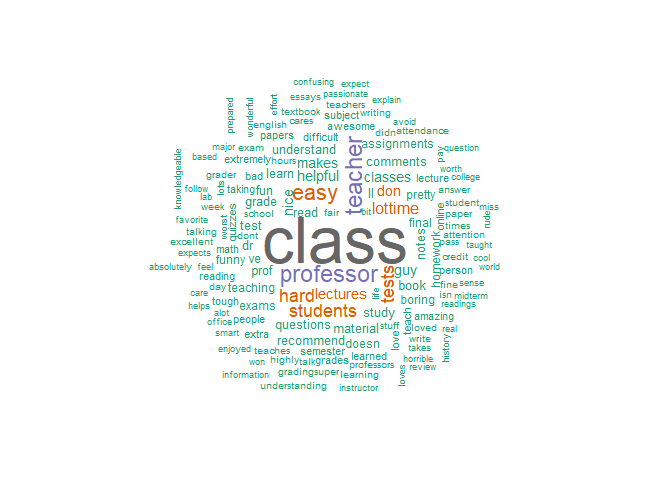

## Packages used


```r
library(rmarkdown)
library(tidyverse)
library(tidytext)
library(wordcloud)
```

***

## Reading and better understanding the data {.tabset .tabset-fade .tabset-pills}

### Getting the data from my Github Repo

Reading in rate my professor data from Mendeley. This dataset is shared by Dr. Jibo HE, founder of the USEE Eye Tracking Inc.  and professor of Tsinghua University."https://data.mendeley.com/datasets/fvtfjyvw7d/2"


```r
"He, Jibo (2020), “Big Data Set from RateMyProfessor.com for Professors' Teaching Evaluation”, Mendeley Data, V2, doi: 10.17632/fvtfjyvw7d.2"
```

```
## [1] "He, Jibo (2020), “Big Data Set from RateMyProfessor.com for Professors' Teaching Evaluation”, Mendeley Data, V2, doi: 10.17632/fvtfjyvw7d.2"
```

```r
professor <- read_csv("https://raw.githubusercontent.com/gdills/dataviz_final_project/main/data/RateMyProfessor_Sample%20data.csv")
```

```
## Parsed with column specification:
## cols(
##   .default = col_double(),
##   professor_name = col_character(),
##   school_name = col_character(),
##   department_name = col_character(),
##   local_name = col_character(),
##   state_name = col_character(),
##   take_again = col_character(),
##   tag_professor = col_character(),
##   post_date = col_character(),
##   name_onlines = col_character(),
##   name_not_onlines = col_character(),
##   attence = col_character(),
##   for_credits = col_character(),
##   would_take_agains = col_character(),
##   grades = col_character(),
##   comments = col_character(),
##   gender = col_character(),
##   race = col_character()
## )
```

```
## See spec(...) for full column specifications.
```

```r
head(professor)
```

```
## # A tibble: 6 x 51
##   professor_name school_name department_name local_name state_name
##   <chr>          <chr>       <chr>           <chr>      <chr>     
## 1 Leslie  Looney University~ Astronomy depa~ "Champaig~ IL        
## 2 Leslie  Looney University~ Astronomy depa~ "Champaig~ IL        
## 3 Leslie  Looney University~ Astronomy depa~ "Champaig~ IL        
## 4 Leslie  Looney University~ Astronomy depa~ "Champaig~ IL        
## 5 Leslie  Looney University~ Astronomy depa~ "Champaig~ IL        
## 6 Leslie  Looney University~ Astronomy depa~ "Champaig~ IL        
## # ... with 46 more variables: year_since_first_review <dbl>, star_rating <dbl>,
## #   take_again <chr>, diff_index <dbl>, tag_professor <chr>, num_student <dbl>,
## #   post_date <chr>, name_onlines <chr>, name_not_onlines <chr>,
## #   student_star <dbl>, student_difficult <dbl>, attence <chr>,
## #   for_credits <chr>, would_take_agains <chr>, grades <chr>,
## #   help_useful <dbl>, help_not_useful <dbl>, comments <chr>,
## #   word_comment <dbl>, gender <chr>, race <chr>, asian <dbl>, hispanic <dbl>,
## #   nh_black <dbl>, nh_white <dbl>, gives_good_feedback <dbl>, caring <dbl>,
## #   respected <dbl>, participation_matters <dbl>, clear_grading_criteria <dbl>,
## #   skip_class <dbl>, amazing_lectures <dbl>, inspirational <dbl>,
## #   tough_grader <dbl>, hilarious <dbl>, get_ready_to_read <dbl>,
## #   lots_of_homework <dbl>, accessible_outside_class <dbl>,
## #   lecture_heavy <dbl>, extra_credit <dbl>, graded_by_few_things <dbl>,
## #   group_projects <dbl>, test_heavy <dbl>, so_many_papers <dbl>,
## #   beware_of_pop_quizzes <dbl>, IsCourseOnline <dbl>
```
### Setting the dataframe up to use text analysis


A decent amount of observations to work with.


```r
nrow(professor)
```

```
## [1] 20000
```


```r
professor_df <- tibble(line = 1:20000, text = professor$`comments`)
```


```r
tidy_professor <- professor_df %>%
                  unnest_tokens(word, text) %>%
    filter(!word %in% stop_words$word,str_detect(word, "[a-z]")) %>% 
                  anti_join(stop_words) %>% 
                  count(word, sort = TRUE)
```

```
## Joining, by = "word"
```
Many of these words don't have much "feeling" or meaning to them when it comes to understanding how students feel about their professors.


```r
head(tidy_professor)
```

```
## # A tibble: 6 x 2
##   word          n
##   <chr>     <int>
## 1 class     14252
## 2 teacher    4086
## 3 professor  3907
## 4 easy       3514
## 5 hard       2633
## 6 students   2626
```

***

## Wordclouds {.tabset .tabset-fade .tabset-pills}

### First word cloud

This word cloud is great for exploratory analysis with the words and shows that many of these words should be filtered out. These words don't add enough context to the analysis. Words such as class, teacher, professor etc...


```r
wordcloud(words = tidy_professor$word, freq = tidy_professor$n, max.words = 150, random.order = FALSE, colors = brewer.pal(8, "Dark2"))
```

<!-- -->

### Second word cloud

Here, I am removing some of the stopwords that I deemed to not add value to the word cloud.


```r
professor_stopwords <- c("class" , "professor" , "teacher" , "time" , "don" , "lectures" , "lot")

tidy_professor2 <- professor_df %>%
                  unnest_tokens(word, text) %>%
    filter(!word %in% stop_words$word,str_detect(word, "[a-z]")) %>% 
    filter(!word %in% professor_stopwords,str_detect(word, "[a-z]")) %>% 
                  anti_join(stop_words) %>% 
                  count(word, sort = TRUE)
```

```
## Joining, by = "word"
```


```r
wordcloud(words = tidy_professor2$word, freq = tidy_professor2$n, max.words = 150, random.order = FALSE, colors = brewer.pal(8, "Dark2"))
```

<!-- -->


## Sentiment Analysis

Separating individual words from the dataset.


```r
library(tidytext)
professor_words <- professor %>% 
  unnest_tokens(word, comments)
head(professor_words)
```

```
## # A tibble: 6 x 51
##   professor_name school_name department_name local_name state_name
##   <chr>          <chr>       <chr>           <chr>      <chr>     
## 1 Leslie  Looney University~ Astronomy depa~ "Champaig~ IL        
## 2 Leslie  Looney University~ Astronomy depa~ "Champaig~ IL        
## 3 Leslie  Looney University~ Astronomy depa~ "Champaig~ IL        
## 4 Leslie  Looney University~ Astronomy depa~ "Champaig~ IL        
## 5 Leslie  Looney University~ Astronomy depa~ "Champaig~ IL        
## 6 Leslie  Looney University~ Astronomy depa~ "Champaig~ IL        
## # ... with 46 more variables: year_since_first_review <dbl>, star_rating <dbl>,
## #   take_again <chr>, diff_index <dbl>, tag_professor <chr>, num_student <dbl>,
## #   post_date <chr>, name_onlines <chr>, name_not_onlines <chr>,
## #   student_star <dbl>, student_difficult <dbl>, attence <chr>,
## #   for_credits <chr>, would_take_agains <chr>, grades <chr>,
## #   help_useful <dbl>, help_not_useful <dbl>, word_comment <dbl>, gender <chr>,
## #   race <chr>, asian <dbl>, hispanic <dbl>, nh_black <dbl>, nh_white <dbl>,
## #   gives_good_feedback <dbl>, caring <dbl>, respected <dbl>,
## #   participation_matters <dbl>, clear_grading_criteria <dbl>,
## #   skip_class <dbl>, amazing_lectures <dbl>, inspirational <dbl>,
## #   tough_grader <dbl>, hilarious <dbl>, get_ready_to_read <dbl>,
## #   lots_of_homework <dbl>, accessible_outside_class <dbl>,
## #   lecture_heavy <dbl>, extra_credit <dbl>, graded_by_few_things <dbl>,
## #   group_projects <dbl>, test_heavy <dbl>, so_many_papers <dbl>,
## #   beware_of_pop_quizzes <dbl>, IsCourseOnline <dbl>, word <chr>
```


Removing stopwords


```r
professor_stopwords <- professor %>% 
    unnest_tokens(word, comments, token = "words") %>%
     filter(!word %in% stop_words$word,str_detect(word, "[a-z]")) 
```

Checking the word count for each individual word.


```r
professor_stopwords %>% 
  group_by(word) %>% 
  summarise(uses = n()) %>% 
  arrange(desc(uses))
```

```
## `summarise()` ungrouping output (override with `.groups` argument)
```

```
## # A tibble: 16,073 x 2
##    word       uses
##    <chr>     <int>
##  1 class     14252
##  2 teacher    4086
##  3 professor  3907
##  4 easy       3514
##  5 hard       2633
##  6 students   2626
##  7 tests      2587
##  8 lot        2112
##  9 time       1919
## 10 don        1876
## # ... with 16,063 more rows
```

Displaying the negative vs positive relationship by implementing the bing lexicon. Very cool to see the ability to "score" someone with positive vs negative attributes.


```r
professor_stopwords %>% 
  inner_join(get_sentiments("bing")) %>%
  count(professor_name, school_name, sentiment) %>%
  spread(sentiment, n, fill = 0) %>%
  mutate(sentiment = positive - negative) %>% 
  arrange(sentiment)
```

```
## Joining, by = "word"
```

```
## # A tibble: 1,402 x 5
##    professor_name     school_name                    negative positive sentiment
##    <chr>              <chr>                             <dbl>    <dbl>     <dbl>
##  1 Daniel  Vona       John Jay College of Criminal ~       54       11       -43
##  2 Barbara  Kimmelman Philadelphia University              59       20       -39
##  3 Zeno  Swijtink     Sonoma State University              51       15       -36
##  4 Daniel  Rodeheaver University of North Texas            49       14       -35
##  5 Elle  Feth         Columbus State Community Coll~       50       15       -35
##  6 Dorathea  Halpert  Brooklyn College                     52       18       -34
##  7 Michael  Scarlatos Pace University (all)                40        6       -34
##  8 Clare  Johnson     Fashion Institute of Technolo~       45       14       -31
##  9 Phyllis  Hirsch    East Los Angeles College             47       17       -30
## 10 Denise  Kelly      Central Connecticut State Uni~       49       20       -29
## # ... with 1,392 more rows
```

Performing a quick check on the "worst" professor, according to the bing lexicon. Sure enough, there are plenty of negative comments.


```r
bad_professor <- professor %>% 
    select(comments, professor_name) %>% 
  filter(professor_name == "Daniel  Vona")

head(bad_professor)
```

```
## # A tibble: 6 x 2
##   comments                                                        professor_name
##   <chr>                                                           <chr>         
## 1 "He is the best, for students who want to study. If you are la~ Daniel  Vona  
## 2 "Grad from class of 1983. Dr. Vona is by far the best professo~ Daniel  Vona  
## 3 "PLEASE IF YOU NEED THIS CLASS TO GRADUATE take another profes~ Daniel  Vona  
## 4 "I am a current student of his and I have to say that the man ~ Daniel  Vona  
## 5 "If you are looking to get a quick A without any work this is ~ Daniel  Vona  
## 6 "Very pretentious and demanding yet it works out to your advan~ Daniel  Vona
```

Seeing which schools have the most comments. This will allow me to pick a few schools and plot the results


```r
professor %>% 
  group_by(school_name) %>% 
  summarize(number_of_professor_reviews = n()) %>% 
  arrange(desc(number_of_professor_reviews))
```

```
## `summarise()` ungrouping output (override with `.groups` argument)
```

```
## # A tibble: 554 x 2
##    school_name                                        number_of_professor_revie~
##    <chr>                                                                   <int>
##  1 Volunteer State Community College                                         860
##  2 Eastern Kentucky University                                               478
##  3 University of Alabama                                                     428
##  4 John Jay College of Criminal Justice                                      331
##  5 Georgia State University Perimeter College - Deca~                        301
##  6 Philadelphia University                                                   298
##  7 Sonoma State University                                                   271
##  8 Denison University                                                        270
##  9 Brooklyn College                                                          256
## 10 Brandon University                                                        236
## # ... with 544 more rows
```


## Sentiment Analysis plot


```r
professor_stopwords %>%
  inner_join(get_sentiments("bing")) %>%
  count(professor_name, school_name,  sentiment) %>%
  spread(sentiment, n, fill = 0) %>%
  mutate(sentiment = positive - negative) %>% 
  filter(school_name == "University of Alabama") %>% 
  ggplot() + 
  geom_bar(aes(x = reorder(professor_name, sentiment), y = sentiment), stat = "identity") + 
  coord_flip() + 
  labs(x = "", title = "Sentiment Analysis of Professor Reviews", 
       subtitle = "Professors from the University of Alabama")
```

```
## Joining, by = "word"
```

<!-- -->


Here I am testing to see if the general consensus for John Baker is positive. Overall, yes his reviews are very positive.

```r
uab_good_professor <- professor %>% 
  select(comments, professor_name) %>% 
  filter(professor_name == "John  Baker")

head(uab_good_professor)
```

```
## # A tibble: 6 x 2
##   comments                                                        professor_name
##   <chr>                                                           <chr>         
## 1 "Dr. Baker really cares about his students. The homework in th~ John  Baker   
## 2 "This class is more of an informative class for your future in~ John  Baker   
## 3 "Dr. Baker is a great professor. AEM 121 was super easy compar~ John  Baker   
## 4 "Dr. Baker is a nice person. I did not like this class however~ John  Baker   
## 5 "Amazing class. Entertaining and knowledgeable, plus he\\'s mo~ John  Baker   
## 6 "Great guy, great class. Incredibly nice and willing to work w~ John  Baker
```

Wow, after looking at the comments, I can see how and why this professor would score badly in the sentiment analysis.


```r
uab_bad_professor <- professor %>% 
  select(comments, professor_name) %>% 
  filter(professor_name == "Jamie  Mills")

head(uab_bad_professor)
```

```
## # A tibble: 6 x 2
##   comments                                                        professor_name
##   <chr>                                                           <chr>         
## 1 "The WORST professor I have ever had. Arrogant, and disrespect~ Jamie  Mills  
## 2 "AWFUL"                                                         Jamie  Mills  
## 3 "disrespectful towards students when you ask her a simple ques~ Jamie  Mills  
## 4 "Very Rude. Treats you like a child because she thinks grad st~ Jamie  Mills  
## 5 "This class about killed me. Seriously, this was an online cla~ Jamie  Mills  
## 6 "This is a hard class. I don\\'t know that I could\\'ve done a~ Jamie  Mills
```


## Conclusion and Next Steps

I would like to explore this data set further. Really cool stuff, being able to analyze individual words from thousands of comments! Who knows, maybe this project could develop into a Shiny app or tool which allows prospective students to search a schools list of professors and dig down quickly into what other students have said about them? 
